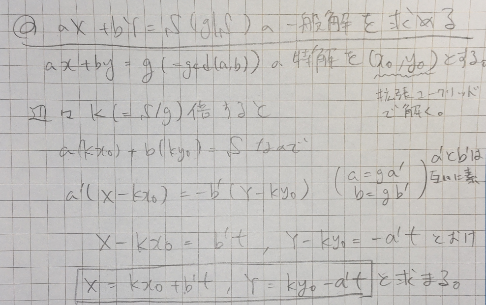

# はじめに
このページでは、競プロでこれまでに学んだ内容（教訓）を端的に箇条書きします。

## 最後の一斉復習日
2024/10/31

# 全探索

## 多重ループ全探索
- ループの数を減らせないか工夫してみる
- ループの数を減らした場合、自動的に決まった変数に矛盾がある場合はcontinueせよ
- 途中までループして後は二分探索などすると、O(N^4)がO(N^2 logN^2)となってACできる場合あり
- 途中からループに意味がなくなる場合breakする事で探索量を減らせる。特にi*j<=Kでのみループを回す必要があるのであれば、計算量はO(KlogK)となり、i*j*k<=Kの3重ループならO(Klog^2K)?となる
- 現在の探索値より真に良いものが何個あるか考えるとすっきりする
### 例題
- 基本 ループ探索計算量を考察する良問（chokudai氏解説動画が神） [D - Cake 123](https://atcoder.jp/contests/abc123/tasks/abc123_d)

## 順列全探索
- 制約数が少なければ全探索を考える
- 後述のBFSやDFSも全探索だが、こちらの方が実装が簡単なので、可能なら順列全探索
- nCrの全探索にも応用可能（bitsetのpattern.count()==rだけ実行する）。この時、trueビット以外の項目をスルーして良いかどうか要確認！（NからK個を選らんでビルが全部見える高さを考える場合、N-K個の選ばれていないビルの高さに影響されてしまう等）
- next_permutationは辞書順に検索できる。しかも重複があってもそれをスキップして探索してくれるので超便利
- next_permutationは使用前にsortが必要！辞書順最後に到達した時点でnextがなくなる為
- 10!は約360万であるので、O(11!)ぐらいまではループで回せる
- 10P5が必要だったとしても、next_permutationで10!回して、先頭の5つを取り出せば10P5の全列挙ができる（計算量が間に合うので）。nPr<=1e8かつn!>1e9のような場合には素直に再帰関数で実装するしかないと思われる
### 例題
- 基本+実装少し工夫 [D - Send More Money](https://atcoder.jp/contests/abc198/tasks/abc198_d)
- 基本 長さKの回文含まない個数 [C - Avoid K Palindrome 2](https://atcoder.jp/contests/abc363/tasks/abc363_c)

## bit全探索
- 各要素を選ぶ選ばないを2進数と考えループ
### 例題
- bit全探索基本 [C - Coverage](https://atcoder.jp/contests/abc289/tasks/abc289_c)
- bit全探索基本 [C - HonestOrUnkind2](https://atcoder.jp/contests/abc147/tasks/abc147_c)

## 再帰全探索
- 次に探索する状態へ再帰でつなぐ。自分自身で終了する事も忘れずに
- 再帰しながら全探索するのではなく、先にオイラーツアーして順番を決めてから再度再帰して全探索する方が良い場合あり（例えば彩色問題。木なら良いが、ループありだと**異なる順番で**同じ配色を選んでしまう重複あり）
- 他にも、連結無向グラフ（ループあり）の終端処理をしたい場合、終端判定がそもそも難しいので、先にオイラーツアーしておけばその順序で処理をかける事ができるなど実装上のメリットもある
- DFSはstackあるいは再帰関数で実装
- 再帰関数で実装する場合、重複演算しないように注意（メモ化再帰で工夫できる場合もある）
- DFSは最終経路まで一つずつ探索する方法であり、再帰関数で実装する事でバックトラックが可能。関数の最初に探索点の履歴をtrue、関数の最後に探索点の履歴をfalseすれば、visited配列を1つ持つだけで実装できる
- グラフのDFSはTLEしないか要チェック。ポイントは再帰呼び出しに重複がないかどうかなので、f(f,x)の手前で再捜索しないような仕組みを入れる
- 具体的にはけんちょんのページが分かりやすい。帰りがけ順使用ノードを再探索しないのは当たり前だが、サイクル検出など行きがけ順済みと帰りがけ順を区別したい場合は別のデータとして持つ事（もちろん行きがけ順使用ノードも再探索しない）
- 頂点を1度だけ訪れれば良い場合は、行きがけ順で探索済みの頂点は再探索不要
- 合計距離Kでゴールにたどり着く迷路問題など、ループを許容し同じ地点での再探索がありうる場合は、頂点以外の情報（距離など）もセットで状態として管理し、状態が同じものは再探索しないようにする
### 例題
- 木DFSの超基本 [C - Simple path](https://atcoder.jp/contests/abc270/tasks/abc270_c)
- 基本 [E - Round Trip](https://atcoder.jp/contests/abc276/tasks/abc276_e)
- 基本 バックトラック [072 - Loop Railway Plan（★4）](https://atcoder.jp/contests/typical90/tasks/typical90_bt)
- !復習価値高 お堀の決め方の数（DFSとUF両方で解いてね） [E - Moat](https://atcoder.jp/contests/abc219/tasks/abc219_e)
- !復習価値低 DFSの訓練に良い [D - RGB Coloring 2](https://atcoder.jp/contests/abc199/tasks/abc199_d)
- 基本 ポリオミオ（Polyomio）の種類数が少ないから解ける [E - Red Polyomino](https://atcoder.jp/contests/abc211/tasks/abc211_e)

# 工夫した探索

## 二分探索法
- ***注意点！！！*** 上下限の見積、オーバーフロー、配列を書き換えない
- lower_boundやupper_boundは二分探索で計算量はO(logN)
- lower_boundの第4引数にgreater<ll>()を指定すると降順ソート列のx以下となるイテレータを返すようになる（upperはx未満）
- 最小値の最大化を二分探索で求められる事が多いのは、最小値（正確には下界）=Xが成立となるかどうかを貪欲法で求められる事が多いから
- 全組合せは膨大すぎて調べられない場合、目的の値（得点など）を二分探索するとO(logN)になる。N=1e18でもlogNは60程度
- 二分探索で最小値を求める問題の場合、f(l)=false、f(r)=trueとなる関数を用いて最終的な答えはr。この時f(x)は答えをx以下（正確にはxを上界）にできるかを返す関数であり、頭が混乱するので注意（Yokan Partyはこの逆）
### 例題
- 基本 超ど典型として人に紹介したい問題 [D - 展覧会 2 (Exhibition 2)](https://atcoder.jp/contests/joig2021-open/tasks/joig2021_d)
- 基本 丸太切り [E - Logs](https://atcoder.jp/contests/abc174/tasks/abc174_e)
- 基本 二分探索良問 [D - 射撃王](https://atcoder.jp/contests/abc023/tasks/abc023_d)
- 基本 幸福度最大握手 [E - Handshake](https://atcoder.jp/contests/abc149/tasks/abc149_e)
- 基本 ようかん（判定悩ましい良問） [001 - Yokan Party（★4）](https://atcoder.jp/contests/typical90/tasks/typical90_a)
- 基本 道路コストP以下が丁度K本の数 [087 - Chokudai's Demand（★5）](https://atcoder.jp/contests/typical90/tasks/typical90_ci)
- 基本 グラフ辺削除コストの最小値 [E - Erasing Vertices 2](https://atcoder.jp/contests/abc267/tasks/abc267_e)
- 基本 [B - 自習 (Self Study)](https://atcoder.jp/contests/joi2022ho/tasks/joi2022ho_b)
- !復習価値低 プロジェクト選出 [D - Project Planning](https://atcoder.jp/contests/abc227/tasks/abc227_d)
- !復習価値低 最強チーム編成 [C - MAD TEAM](https://atcoder.jp/contests/zone2021/tasks/zone2021_c)
- 基本 oの最大連続部分列長 [F - More Holidays](https://atcoder.jp/contests/abc300/tasks/abc300_f)
- !要復習 [D - 安全点検 (Safety Inspection)](https://atcoder.jp/contests/joi2021yo2/tasks/joi2021_yo2_d)

## 二分探索による中央値探索
### 例題
- 基本 中央値の最小値 良問 [D - Pond](https://atcoder.jp/contests/abc203/tasks/abc203_d)
- !復習価値低 全連続部分列の中央値 [D - Median of Medians](https://atcoder.jp/contests/abc107/tasks/arc101_b)

## 二分探索による平均最大化
- 分母と分子に変数がある場合の最大値を求めたい場合、答えを決め打つと二分探索に持ち込める場合あり
- 平均最大化はその典型例
- 最短経路問題でsum(bi)/sum(ci)（bi,ciは各辺に割りつけられた価値とコスト）を最大化せよという問題の場合、コストが単純でないので普通に解けない。こんな時に答えXを決め打ちし、それ以上になるかどうかという問題に置き換えると、sum(bi-X*ci)>=0と変形できるので二分探索を使うことができる（なお、この問題は平均最大化という有名テクニック）
### 例題
- 基本 平均最大化の類題 [F - Beautiful Path](https://atcoder.jp/contests/abc324/tasks/abc324_f)
- 基本 砂糖水濃度最大化 [F - Sugar Water 2](https://atcoder.jp/contests/abc294/tasks/abc294_f)
- 基本 平均＆中央値最大化（良問） [E - Average and Median](https://atcoder.jp/contests/abc236/tasks/abc236_e)

## 三分探索法
- 狭義に下に凸の区間における最小値を求めるときに使える。
- 幅が2になるまでwhileループさせる
- 最後はleftからrightまでの最小値を求めれば良い
- 最小包含円のようにxy平面で凸な関数となる場合は二重に三分探索すれば良い
- double型の三分探索はr-lの幅ではなく回数を決め打ちすると良いが、収束が意外に遅いので注意。(2/3)^100でも1e-17ぐらいなので、場合によっては100回では足りない
### 例題
- 基本 コンピュータ最短計算（double型の三分探索） [B - ムーアの法則](https://atcoder.jp/contests/arc054/tasks/arc054_b)
- 基本 重力定数変えられる自由落下 [D - Freefall](https://atcoder.jp/contests/abc279/tasks/abc279_d)
- 基本 最小包含円 [F - Enclose All](https://atcoder.jp/contests/abc151/tasks/abc151_f)

## 尺取り法（Two-pointer approach）
- 単調性があるときに使用可能
- 半開区間[l,r)で考えると、要素を全く選ばなかった時も考慮可能なので便利
- [l,r)では条件を満たしているので、条件を満たす範囲でrを進められるだけ進める
- 半開区間なので、while(r<N && sum+A[r]<=K)などして次の[l,r+1)を試す。もともと半開区間のデータ（例えば累積和）であれば、while(r<N && S[r+1]-S[l])などとする
- whileを抜けた後のrはrを進める条件に当てはまらない状態という事
- 例えばwhile(r<N && sum+A[r]<=K)なら、whileを抜けた後はsum+A[r]>Kとなっている（もしくはr==Nかつsum+A[r]<=K）
- whileを抜けた後に直前の値を参照したいならA[r-1]とする必要がある
### 例題
- 基本 K以上となる個数問題 [D - Enough Array](https://atcoder.jp/contests/abc130/tasks/abc130_d)
- 基本 [076 - Cake Cut（★3）](https://atcoder.jp/contests/typical90/tasks/typical90_bx)
- 基本 [C - 列](https://atcoder.jp/contests/abc032/tasks/abc032_c)
- 基本 XORの性質 [D - Xor Sum 2](https://atcoder.jp/contests/abc098/tasks/arc098_b)
- 基本 min|x^2+y^2-D| [C - Minimize Abs 2](https://atcoder.jp/contests/abc330/tasks/abc330_c)
- !復習価値低 O(N)でも解きたい [D - Many Segments 2](https://atcoder.jp/contests/abc377/tasks/abc377_d)
- 基本 最大値X最小値Yとなる区間の総数 [E - Max Min](https://atcoder.jp/contests/abc247/tasks/abc247_e)
- 基本 交差1の数列が全要素を包含するか（snuke氏考察はオーバーキル） [E - At Least One](https://atcoder.jp/contests/abc260/tasks/abc260_e)

## 半分全列挙
- N=40程度のとき、2^NはTLEするが2^(N/2)であればTLEしない事を利用
- 数列を半分に分け、それぞれで全探索する
- その後、問題に応じて上手く組み合わせる事ができるのであれば使えるアルゴリズムである
- N=10^12程度のとき、10^6に分けるとうまくいくような問題もある（数列の二乗など）
### 例題
- 基本 [C - ダーツ](https://atcoder.jp/contests/joi2008ho/tasks/joi2008ho_c)
- 基本 [051 - Typical Shop（★5）](https://atcoder.jp/contests/typical90/tasks/typical90_ay)
- 基本 XORが0になる経路数 [F - XOR on Grid Path](https://atcoder.jp/contests/abc271/tasks/abc271_f)
- !復習価値低 ロボット移動 [F - Robot Rotation](https://atcoder.jp/contests/abc326/tasks/abc326_f)

# ソート

## STLのソート
- lower_bound関数で、配列中のどこの間に入るかわかる（戻り値がイテレータである事に注意）
- 上手く規格が合わずソートできない場合は、無理やり規格を合わせてごちゃ混ぜソートすると解ける場合あり（e.g. 1分でB点、2分でA点取れる場合、1分でB点取り、更に1分でA-B点取れると考えるなど）
- sort()関数の第3引数に自作関数compを渡すことが可能。ただしcomp(a,a)==falseとなる事が必要。compの第1引数を左に並べたい場合にtrueを返せばよい

## 転倒数
- バブルソートするのに必要な回数であるが、より本質的にはai>ajとなるペアの組合せの数と等しい（ソートにはこれ以上の回数が必要な事は自明だし、ソートが終わっていない時このような隣り合うペアが存在するので）
- 全探索するとO(N^2)だが、BIT木を使えばO(NlogN)で可能。
### 例題
- 基本+α [F - Sorting Color Balls](https://atcoder.jp/contests/abc261/tasks/abc261_f)
- 基本 [K - 転倒数](https://atcoder.jp/contests/past202010-open/tasks/past202010_k)
- 基本 全組み合わせでのf(Si,Sj)の和 [F - Merge Sets](https://atcoder.jp/contests/abc306/tasks/abc306_f)
- 基本 [C - Swaps 2](https://atcoder.jp/contests/arc120/tasks/arc120_c)
- !復習価値低 [N - 入れ替えと並び替え](https://atcoder.jp/contests/past202005-open/tasks/past202005_n)

## ペア積（要素積）のmaxを最小化
- 集合Aと集合B（サイズは同じ）の要素積のmaxを最小化したい場合、Aの降順、Bの昇順を組み合わせると良い
- 割と自明とみなされているようだが、ここの理解に苦しんだ
- Aの降順、Bの昇順を並べて組み合わせを考える場合、もしクロスしている組み合わせがあれば、組み合わせを逆にすることでかならずmax値は減少する
- 上記をクロスがなくなるまで操作すれば最適な組み合わせとなり、すなわちそれは最初に述べた組み合わせである
### 例題
- 基本 [E - Gluttony](https://atcoder.jp/contests/abc144/tasks/abc144_e)
- !復習価値高 [D - Worst Case](https://atcoder.jp/contests/abc093/tasks/arc094_b) [解説は自分の提出に記載](https://atcoder.jp/contests/abc093/submissions/60403345)

## ペアつなぎ
- 個別の区間に注目すると、最低何本は線があるかどうか分かる（下界）
- その最低本を達成するつなぎ方をすれば、それが最適だと分かる
- 最適なつなぎ方の通り数を求めたい場合は、つなぐ時につなぎ方の場合の数を掛け合わせていけば良い
### 例題
- 基本 [014 - We Used to Sing a Song Together（★3）](https://atcoder.jp/contests/typical90/tasks/typical90_n)
- 基本 PC電源つなぎ方総数 [A - 1D Matching](https://atcoder.jp/contests/cf16-exhibition-final-open/tasks/cf16_exhibition_final_a)

# 座標圧縮
- 簡単に実装するなら、圧縮前の座標をmap[x]=0 (for all x)で用意しておき、int i=0; for (auto [k, _]: map) {map[k] = i++;}でOK
- 以下はmapの定数倍の遅さを解決したい場合の手法（あまり使う事はないかもしれない）
- 重複要素削除はソート後にvec.erase(unique(all(vec)), vec.end())で可能。uniqueは隣接の重複しか削除しないので事前ソート必須。また、uniqueはベクター長を変えないので、eraseで末尾のゴミを削除しておくこと
- 後は求めたい数字が上記ベクターの何番目にあるか調べれば良い。lower_boundを用いる
- IMOS法用に座標圧縮する場合は、-1を入れるための箱を用意する事（例：3~5の累積を取りたいとき、座標としては3と6とすべきで、5でないことに注意）

# 区間の問題

## 累積和
- 区間和を高速に求める事ができる
- 元の配列に仕切りをいれて、図示するとイメージしやすい（区間和は半開区間で求めるイメージ）
- 累積和の添え字は、元の数列で何個選んだかと言い換えることもできる
- 例えばA[l]～A[r]の和はS[r+1]-S[l]だが、これはr+1個からl個を除いたものとも解釈できる（元の数列が0-indexedなので、A[l]はl+1個目である事に注意）
- 元の数列が非負なら累積和は必ず広義単調増加、非正なら必ず広義単調減少となる
- 逆向きに累積和と取れば単調減少（単調増加）となる
- 和だけでなく、累積XORや累積GCDも考えられる（要するにnow=f(now,x)みたいな形で更新できる演算であれば何でも累積できる。区間を求められるかは別問題だが・・・）
### 例題
- 基本 （累積和ではないのでNote非掲載 ）[C - GCD on Blackboard](https://atcoder.jp/contests/abc125/tasks/abc125_c)
- 基本+α 幾つかの区間和から総和が求まるか [E - Range Sums](https://atcoder.jp/contests/abc238/tasks/abc238_e)
- 基本 単調増加数列へ変換（解法が分かるなら実装必要なし） [D - Non-decreasing](https://atcoder.jp/contests/abc081/tasks/arc086_b)
- !復習価値中 setのサイズを足していく [E - Set Add Query](https://atcoder.jp/contests/abc347/tasks/abc347_e)
- !復習価値高 当選必要票数 [E - How to Win the Election](https://atcoder.jp/contests/abc373/tasks/abc373_e)

## 2次元累積和
- 累積和は2次元でも取れる
- 包除原理的な考え方で累積和を取る
- 区間和を取るときも包除原理的な考え方でやる
### 例題
- 基本 [A - 惑星探査 (Planetary Exploration)](https://atcoder.jp/contests/joi2011ho/tasks/joi2011ho1)
- 基本 [D - AtCoder Express 2](https://atcoder.jp/contests/abc106/tasks/abc106_d)
- 基本 市松模様の最適場所 [D - Checker](https://atcoder.jp/contests/abc086/tasks/arc089_b)
- 基本 たこ焼きおいしさmax [D - おいしいたこ焼きの焼き方](https://atcoder.jp/contests/abc005/tasks/abc005_4)

## IMOS法
- 重なり領域の累積はいもす法を用いて解決
- IMOS法は配列数が多すぎるときは座標圧縮とのコンビネーションで解ける問題多し
- 累積ではなく、重なっているかだけの判定で良ければ、引継ぎ型dpで解ける（ある点から何個後ろまで加算すべきかという情報において、何個の部分をmax取りしていけばよい）
- 木の上でもimos法は使える
### 例題
- 基本 [D - Union of Interval](https://atcoder.jp/contests/abc256/tasks/abc256_d)
- 基本 [A - 鉄道旅行 (Railroad Trip)](https://atcoder.jp/contests/joi2015ho/tasks/joi2015ho_a)
- 基本 二次元IMOS [028 - Cluttered Paper（★4）](https://atcoder.jp/contests/typical90/tasks/typical90_ab)
- 基本 木上の累積和 [E - Through Path](https://atcoder.jp/contests/abc187/tasks/abc187_e)
- 基本 海洋生息区域重なり [E - 魚の生息範囲 (Fish)](https://atcoder.jp/contests/joi2013yo/tasks/joi2013yo_e)
- 基本 分断領域の個数 [E - ペンキの色](https://atcoder.jp/contests/joi2008ho/tasks/joi2008ho_e)

## 連続部分列問題
- 左右を固定してO(N^2)を考えた後、右端を固定して高速に求められないか検討すると良い
- キーワード：連続部分列は累積和！（もしくは尺取り法）
- 和がKとなる連続部分列が存在するかどうかは、累積和をsetに入れておけば判定可能。S[i]+KとなるS[j]が存在するのであれば、[i,j)の和はKという事
- 連続部分列の和がある値Kとなる個数を求めるには、Sr-Sl=Kとなれば良いので、Slをmap[Sl]=（Slとなる個数）としておけば高速に求められる
- map[0] = 1という初期化を忘れずに！（累積和は0から始まる）
- 数列の連続部分列[L,R]の中で値がKに一致する個数を求める場合、事前にK毎にvectorを用意しておき、そのvectorにKとなる要素番号を格納しておく。後は[L,R]となる個数をupper_boundで調べれば良い
- Kと一致ではなくK以上の個数などとなる場合はmapで累積和を保存しても個数が求められないので尺取り法か二分探索
- 累積和のMODが部分列の長さと一致するという問題でも応用可能。具体的には最初に1ずつ引いた数列にしておけば、累積和を取った時に長さ分の考慮が不要となる（ただしr-lがM以上の場合は数えないようにする）
- 0-9で構成された連続部分文字列がMOD Pで0になる個数を求める問題は、右から見ていくと良い（左から見ると単純に足していけない、もちろん累積和も、ので）
### 例題
- 基本 累積和がMの倍数となる区間の総数 [D - Candy Distribution](https://atcoder.jp/contests/abc105/tasks/abc105_d)
- 基本 連続部分文字列がMOD Pで0になる個数 その1 [D - Multiple of 2019](https://atcoder.jp/contests/abc164/tasks/abc164_d)
- 基本 [D - Three Days Ago](https://atcoder.jp/contests/abc295/tasks/abc295_d)
- 基本 区間の中でXに一致する個数 [D - Range Count Query](https://atcoder.jp/contests/abc248/tasks/abc248_d)
- 基本 連続部分文字列がMOD Pで0になる個数 その2 [E - Divisible Substring](https://atcoder.jp/contests/abc158/tasks/abc158_e)
- 基本 累積和MODが部分列の長さと一致の個数数え上げ [E - Rem of Sum is Num](https://atcoder.jp/contests/abc146/tasks/abc146_e)
- !復習価値低 [H - JOIOJI](https://atcoder.jp/contests/joisc2014/tasks/joisc2014_h)
- 基本 [美術展 (Art Exhibition)](https://atcoder.jp/contests/joi2018ho/tasks/joi2018ho_b)

## Mo's Algorithm
- 連続部分列の区間1増減をO(1)で計算できる場合、クエリ回数QとするとO(N sqrt(Q))で全てのクエリに答えられる
- クエリ[l,r)を座標上にプロットし、sqrt(Q)個に分割（すなわち高さをN/sqrt(Q)に分割）し、各分割ブロックごとに小さい順に辿って行けば良い
- r>=lの領域をはみ出さないように、さきに--lと++rをした方が良い
### 例題
- 基本 指定区間で同色ペアを何組作れるか[G - Range Pairing Query](https://atcoder.jp/contests/abc242/tasks/abc242_g)
- !復習価値低 [N - 数列と関数](https://atcoder.jp/contests/past202212-open/tasks/past202212_n)

## ある順列P{1,2,...,N}の区間max値の総和
- 全区間を試すとO(N^2)なので、ある数が何回出現するかを高速にカウントすれば、O(N)（本当はO(NlogN)）で求められる
- 数が大きい順に見るループを作り、まず自分自身のインデックスをsetに突っ込む
- setの中で、自分より1つ小さいインデックスをlとし、nl = idx - lとする
- setの中で、自分より1つ大きいインデックスをrとし、nr = r - idxとする
- nl * nrが、その数が最大値となる区間数であるので、区間数*その数をansに足す
- 文章ではわかりにくいので、[snuke氏の解説参照](https://www.youtube.com/live/VSeggcnxwrc?feature=shared&t=5618)
- 本テクニックは、区間2nd maxやK-th maxでも応用可能
### 例題
- !復習価値小 区間2nd maxの総和 [E - Second Sum](https://atcoder.jp/contests/abc140/tasks/abc140_e)
- 基本 全2頂点間最大辺の総和問題（グラフでなく数列であっても同じ考え方でいけるはず） [D - Sum of Maximum Weights](https://atcoder.jp/contests/abc214/tasks/abc214_d)

# 最短経路問題

## BFS
- BFSはqueueで実装
- ループの先頭でpopして、空になるまで継続
- queueに入れるのは状態、目的値（最短距離など）はvectorで管理。
- ループありグラフを全探索するなら使用した頂点を訪れないように工夫が必要（目的値が存在しない頂点のみ辿るなど）
- この時、queueに入れる直前にvisitedフラグを立てる等しないと、同距離の頂点が重複してqueueに入ってしまうので注意（目的値を更新しているのであれば特に問題ない）
- 最短経路問題にBFSが使用可能。（e.g. 迷路の最短経路問題、01-BFS）
- 最短経路問題や01-BFSについては動的計画法の章で言及
- ボードゲームの全探索にも使用可能。各マスの状態を並べたベクトルを状態ベクトルとしてqueueに突っ込む
### 例題
- 基本 [D - テンキー (Tenkey)](https://atcoder.jp/contests/joi2020yo2/tasks/joi2020_yo2_d)
- 基本 [C - 菱型カウント](https://atcoder.jp/contests/abc018/tasks/abc018_3)
- !復習価値中 [B - パンケーキ (Pancake)](https://atcoder.jp/contests/joi2021yo2/tasks/joi2021_yo2_b)
- !要復習 [C - 鉄道運賃 (Train Fare)](https://atcoder.jp/contests/joi2016ho/tasks/joi2016ho_c)

## 01-BFS
- 辺のコストが0か1しかない最短経路問題に使用可能
- ダイクストラ法の単純な場合と言っても良い（最小コスト頂点が自明な為。logが無いので計算も速い）
- 0コスト辺の場合、接続先頂点をqueのfrontに、1コスト辺の場合、接続先頂点をqueのbackにpushする事で実装可能
- 単純BFSのようにdist[nv]!=INFでcontinueしてしまうと上手く動作しないので注意！ダイクストラのように、距離が更新できる時のみ更新するとしないといけない（BFSは書き込まれる距離が昇順だが、01-BFSの場合は書き込まれる距離が2種類ある為）
### 例題
- 基本 [043 - Maze Challenge with Lack of Sleep（★4）](https://atcoder.jp/contests/typical90/tasks/typical90_aq)
- 基本 [D - Wizard in Maze](https://atcoder.jp/contests/abc176/tasks/abc176_d)
- !復習価値低 基本 [E- Bishop 2](https://atcoder.jp/contests/abc246/tasks/abc246_e)
- 基本 壁破壊 [E - Stronger Takahashi](https://atcoder.jp/contests/abc213/tasks/abc213_e)

## ダイクストラ法（Dijkstra）
- 下記を繰り返していくことで、全頂点の距離を更新していき、最短経路を求める
- 始点（複数可）は0、それ以外の全頂点にINFを代入
- 確定された頂点に接続された頂点を更新
- 未確定頂点の中から最小コスト頂点を確定（その他の頂点がその頂点の距離を更新する事がありえない為）
- 負辺や負閉路があると使えない
- 実装はpriority_queueを用いると簡単。pushした時点の距離が更新されていたらそのpop値は破棄する
- しかしながら、完全グラフなど辺の数が多い場合は、O(N^2)で実装した方が速い。ヨビノリ動画の通りに素直に実装すれば良い。自分で解いた例は[こちら](https://atcoder.jp/contests/joi2014yo/submissions/42739462)
- ダイクストラ木を構成するには、各頂点がどの辺を使って辿りついたのかをキューに入れるタイミングで記録する。計算過程では複数経路で同じ頂点に辿り付くが、最終的に使われた（＝距離を更新した）経路が正しい（自明）。
### 例題
- 基本 典型+α（snuke氏解説の実装がスマート） [E - Come Back Quickly](https://atcoder.jp/contests/abc191/tasks/abc191_e)
- 基本 Kの倍数の時だけ発車可能 [E - Train](https://atcoder.jp/contests/abc192/tasks/abc192_e)
- !復習価値低 終電 [E - Last Train](https://atcoder.jp/contests/abc342/tasks/abc342_e)
- !要復習 [N - 壁の建設計画](https://atcoder.jp/contests/past202206-open/tasks/past202206_n)
- !復習価値中 [D - フクロモモンガ (Sugar Glider)](https://atcoder.jp/contests/joi2014ho/tasks/joi2014ho4)
- !要復習 [O - 宝箱](https://atcoder.jp/contests/past202010-open/tasks/past202010_o)

## 拡張ダイクストラ法（or 拡張BFS）
- 頂点に状態を持たせる事で拡張する手法。頂点と状態をqueに入れる
- 例えば、辺に距離だけでなく金銭が必要な場合、所持金を状態としてキューに入れると良い
### 例題
- 基本 [E - Swap Places](https://atcoder.jp/contests/abc289/tasks/abc289_e)
- 基本 2プレーヤー [D - Synchronized Players](https://atcoder.jp/contests/abc339/tasks/abc339_d)
- 基本 [D - Go Stone Puzzle](https://atcoder.jp/contests/abc361/tasks/abc361_d)
- !復習価値低 [E - パレード (Parade)](https://atcoder.jp/contests/joig2021-open/tasks/joig2021_e)
- !復習価値高 温度差屋敷脱出 [F - ヘビの JOI 君 (Snake JOI)](https://atcoder.jp/contests/joi2017yo/tasks/joi2017yo_f)
- 基本 グラフで回文 [F - Construct a Palindrome](https://atcoder.jp/contests/abc197/tasks/abc197_f)
- 基本 通貨払い最短経路 [E - Two Currencies](https://atcoder.jp/contests/abc164/tasks/abc164_e)
- !復習価値高 頂点使用回数偶奇ごとの最短パス長 [F - Shortest Good Path](https://atcoder.jp/contests/abc244/tasks/abc244_f)
- !要復習 [F - タクシー 2 (Taxis 2)](https://atcoder.jp/contests/joig2022-open/tasks/joig2022_f)

## ポテンシャル法
- ダイクストラは負辺があると使えないが、各頂点にポテンシャルを設定できれば全辺を非負に変換でき、ダイクストラが使えるようになる
- ポテンシャルは重力ポテンシャルのようなもので、経路によらず保存されるような値
- 問題設定上明らかな場合以外は、ベルマンフォードなどでポテンシャルを求める必要あり。この場合の計算量はO(NM)なので、全頂点にダイクストラを用いてもO(NMlogM)となり、後述のワーシャルフロイドより改善する（辺の数が少なければ）
- なお、ポテンシャルの割り当てが存在する事の必要十分条件は、負閉路がないこと
### 例題
- !復習価値中 ポテンシャルを理解する良問 [F - Pay or Receive](https://atcoder.jp/contests/abc280/tasks/abc280_f)
- !復習価値低 [E - Skiing](https://atcoder.jp/contests/abc237/tasks/abc237_e)

## ワーシャルフロイド法（Warshall-Floyd）
- 全頂点から全頂点への最短経路を求める方法。計算量はO(N^3)
- 3重ループにより、経由値との比較をして順次行列を更新する
- 経由地が一番外側のループ！！（例えばa->b->c->dが最短路の時、a->dを最初に更新してしまうとこの経路は現れない）
- dist[i][i]=0で初期化しないと壊れるので注意！（chmin(d[i][i], d[i][k]+d[k][i]） の時に壊れる）
- 負辺があっても使えるが、負閉路があると使えない（負辺がある場合、INFの辺を使って更新しない事！！！INF＋マイナスの値がINFより小さいので、更新してはいけないものを更新してしまう）
- ただし負閉路検出は可能。自分自身への最短経路が負になった場合、負閉路ががあると検出できる！
- **負閉路があると絶対値が指数関数的に増加するので、毎回のループの中でdist[i][i]<0となったらすぐに切り上げる事！**
- ワーシャルフロイド後の行列が与えられたとして、不要な辺を除く事を考える事もできる
- まず完全グラフを行列の通り作成、次に全辺に対して、三角不等式が等号成立するような経由頂点が存在する場合はその辺を削除すれば良い
- この時、同じ辺は1度だけ削除するように！（何度も削除しないように）
- 当然だが、三角不等式が不成立の場合はおかしいので、この場合はワーシャルフロイド後の行列として間違っていたということ
### 例題
- 基本問題 [D - バスと避けられない運命](https://atcoder.jp/contests/abc012/tasks/abc012_4)
- !復習価値低 負閉路検出付きの基本問題 [All Pairs Shortest Path](https://judge.u-aizu.ac.jp/onlinejudge/description.jsp?id=GRL_1_C&lang=ja)
- 基本 仕組みを理解する教育的良問 [D - Shortest Path Queries 2](https://atcoder.jp/contests/abc208/tasks/abc208_d)
- 基本 ワーシャルフロイド後行列 [D - Restoring Road Network](https://atcoder.jp/contests/abc074/tasks/arc083_b)

## ベルマンフォード法
- 負閉路があっても使える最短経路を求めるアルゴリズムで、計算量はO(NM)
- 負辺がある場合、距離INFの頂点からの更新はしない事！！！INF＋マイナスの値がINFより小さいので、更新してはいけないものを更新してしまう
- 全辺に対して、dist[v] > dist[u] + costである限り更新し続ける
- 更新ステップ数がNを超えたら、負閉路があるということ
- 始点と終点に関係ない点をあらかじめ除いておく事で、関係ない負閉路を使うことを避ける事も重要
### 例題
- !復習価値高 [E - Coins Respawn](https://atcoder.jp/contests/abc137/tasks/abc137_e)

## 一度に複数辺を進める場合の最短経路
- 所持燃料に限界がある場合、補給なしで到達可能な頂点間を長さ1の辺で結ぶ事により、最小補給回数を求めることができる（正しくは最小補給回数+1が求まる）
### 例題
- !復習価値低 燃料補給回数 [E - Travel by Car](https://atcoder.jp/contests/abc143/tasks/abc143_e)  （参考：[距離1/Kで燃料補給は切り上げ方式の別解](https://atcoder.jp/contests/abc143/submissions/50298596)だが、計算量改善、ダイクストラO(N^2)方式の優先順位、最終的な答えの求め方（切上？切捨？）が難しすぎるので非推奨。こんな解き方もできるよ程度）
- !復習価値低 定額タクシー [E - タクシー (Taxis)](https://atcoder.jp/contests/joi2014yo/tasks/joi2014yo_e)

## 最短経路問題+α
- 最短経路の中で最大価値を求める（距離を{経路,-価値}のpair型にしてダイクストラやワーシャル・フロイド）
- 2頂点を同時に動かす最短経路問題は、queueに二つの頂点を入れればOK。
- 最短経路となるパスの場合の数を同時に求める事も可能（pair型にしておいて、{経路長,数}を更新していけば良い）
- 同方向は最大Kまでしか進めないという応用問題の場合、方向の状態に加え、同方向は1/K、方向転換は切り上げというダイクストラをすれば解ける（実装上はK倍した値で管理すると良い）
### 例題
- !復習価値低 最短閉路問題 [C - Blue Bird](https://atcoder.jp/contests/abc022/tasks/abc022_c)
- !復習価値低 最短路かつ最大価値 [E - Souvenir](https://atcoder.jp/contests/abc286/tasks/abc286_e)
- !復習価値中 最短経路＋その場合の数（巡回セールスマン） [G - Revenge of Traveling Salesman Problem](https://atcoder.jp/contests/s8pc-1/tasks/s8pc_1_g)
- !復習価値低 [F - Pond Skater](https://atcoder.jp/contests/abc170/tasks/abc170_f)

# グラフ

## 木と森
- 要素数が辺の数＋1のとき木になる
- ある要素からの部分木サイズをxとすると、上側部分木のサイズは(N-x)と求まる
- 連結とは限らない閉路を含まないグラフを森という（木が幾つも含まれたグラフ）
- 森の連結成分数は頂点数 - 辺の数
- 次数が2以下の木をパスという（パスは、次数2以下かつ閉路なしで判定可能）
- 距離が2以下の場合〇〇系の問題は、ある頂点を中心に考えると親と子しかいない。子に対する処理（数え上げなど）をする事で解ける問題あり
### 例題
- !復習価値中 森の連結成分数の性質 [F - Intervals on Tree](https://atcoder.jp/contests/abc173/tasks/abc173_f)
- !復習価値中 距離が2以下は異なる場合のK彩色 [E - Virus Tree 2](https://atcoder.jp/contests/abc133/tasks/abc133_e)
- !要復習 部分木フリップ [C - Lights Out on Tree](https://atcoder.jp/contests/arc148/tasks/arc148_c)

## 木の直径、重心
- xの最遠点yの最遠点zとすると、yとzの距離が直径となる
- 任意の頂点vからの最遠点は、yかzのどちらかである
- ある頂点から与えれた距離の頂点を素早く見つけるには、直径の端点からのパスだけ記録して置けば良い（最も遠い点はどちらかの端点になるはずなので）
- 移動先部分木サイズTが総和/2より大きければ、重心はその移動先にある
- なぜなら総モーメントは移動する事でT減り、(tot-T)増える事になるので、T>tot/2であれば必ず総モーメントは減る事になる
- tot/2を探して潜る実装は面倒なので、（親側も含め）全部分木サイズがtot/2以下であれば重心としてメモすれば良い
### 例題
- 木の直径基本 [003 - Longest Circular Road（★4）](https://atcoder.jp/contests/typical90/tasks/typical90_c)
- 基本 [E - Tree and Hamilton Path 2](https://atcoder.jp/contests/abc361/tasks/abc361_e)
- !復習価値高 木の頂点からある距離にある頂点 [F - Exactly K Steps](https://atcoder.jp/contests/abc267/tasks/abc267_f)
- !復習価値高 木の重心 [E - Minimize Sum of Distances](https://atcoder.jp/contests/abc348/tasks/abc348_e)
- !復習価値中 任意の頂点からのコストmax点（全方位でも解いてね） [F - Expensive Expense](https://atcoder.jp/contests/abc222/tasks/abc222_f)

## オイラーツアーと部分木
- 木に対してDFSの行きがけ順に探索する事をオイラーツアーと呼ぶ
- 各頂点に対し、オイラーツアーの行きがけ順を開始時と終了時に記憶しておくと部分木の半開区間が求まる
- 各頂点を探索している時に、その頂点に対する操作をするのか、あるいは繋がっている全頂点に対する操作（場合の数をかける等）をするのか、色々バリエーションあり
- 区間をぎっちり詰めたい場合は、葉の個数分だけの区間長になる（この場合は葉のたびにインクリメント）
### 例題
- 基本 部分木を区間で表現 [E - Ranges on Tree](https://atcoder.jp/contests/abc240/tasks/abc240_e)
- 基本 オイラーツアーの性質 [E - Count Descendants](https://atcoder.jp/contests/abc202/tasks/abc202_e)

## LCA（Lowest Common Ancester）
- 色々やり方はあるらしいが、Euler Tourを用いる方法を学習した
- オイラーツアーの順に区間用のセグツリーやBIT木を適用すると色々対応可能
### 
- 基本 [D - 閉路](https://atcoder.jp/contests/abc014/tasks/abc014_4)
- !復習価値低（実装重いのでライブラリAC+解説動画見るだけでOK） 木の頂点間距離 w/オンラインコスト変化 [G - Distance Queries on a Tree](https://atcoder.jp/contests/abc294/tasks/abc294_g)

## 完全二分木
- 全ての葉が同じ深さを持ち、葉以外の全ての頂点が子を二つ持つ二分木を完全二分木と呼ぶ
- 再帰的な構造を持っている為、高さhの関数f[h]はf[h-1]を用いて計算できる事が多い
- このとき、f[h]とf[h-1]は根を同じくする関係（上が一緒）か、あるいは葉を同じくする関係（下が一緒）と両方考えられる
- 長さが二倍二倍と増えていく場合、操作後の先頭からの番号を二進数で表すと見通しが良くなる
### 例題
- 基本 [D - Moves on Binary Tree](https://atcoder.jp/contests/abc243/tasks/abc243_d)
- !復習価値中 [D - Strange Mirroring](https://atcoder.jp/contests/abc380/tasks/abc380_d)
- !復習価値高 [D - ABC Transform](https://atcoder.jp/contests/abc242/tasks/abc242_d)
- !復習価値中 距離Dとなる頂点組の個数 [E - Distance on Large Perfect Binary Tree](https://atcoder.jp/contests/abc220/tasks/abc220_e)
- !復習価値高 距離Dとなる頂点の個数 [E - Complete Binary Tree](https://atcoder.jp/contests/abc321/tasks/abc321_e)

## 木の次数列
- 次数の合計が2(N-1)かつ全ての次数が1以上なら必ず木を構成できる
### 例題
- !復習価値中 木の次数列の和=2N-2 [F - Tree Degree Optimization](https://atcoder.jp/contests/abc359/tasks/abc359_f)
- !要復習 [F - Construct Highway](https://atcoder.jp/contests/abc239/tasks/abc239_f)

## 最小全域木（MST: Minimum Spanning Tree）
- 全域木の中で辺の和が最小のものをいう
- クラスカル法により小さい順に連結頂点同士をつながないように辺を追加していく
- 連結頂点の判定はUnion-Find木を用いる
### 例題
- 基本 [Minimum Spanning Tree](https://judge.u-aizu.ac.jp/onlinejudge/description.jsp?id=GRL_2_A&lang=ja)
- 基本 典型+α [D - Built?](https://atcoder.jp/contests/abc065/tasks/arc076_b)
- 基本 追加辺はMSTに使われるか？ [E - MST + 1](https://atcoder.jp/contests/abc235/tasks/abc235_e)
- 基本 後から辺追加（MSTの本質を理解しているかどうか問われる良問） [F - MST Query](https://atcoder.jp/contests/abc355/tasks/abc355_f)
- !復習価値低 [049 - Flip Digits 2（★6）](https://atcoder.jp/contests/typical90/tasks/typical90_aw)
- !復習価値低 区間MST [F - Range Connect MST](https://atcoder.jp/contests/abc364/tasks/abc364_f)
- !要復習 [K - 遺産相続](https://atcoder.jp/contests/joisc2015/tasks/joisc2015_k)

## 全域木の構成
- 無向グラフから全域木を構成すると見通しが良くなる事がある
- 全域木を構成するにはMSTの他、DFS木、BFS木、最短経路木などがある
- DFS木の後退辺（未使用辺）は必ず祖先の関係になる
- BFS木の未使用辺は必ず祖先の関係にならない
### 例題
- 基本 二つの全域木 [F - Two Spanning Trees](https://atcoder.jp/contests/abc251/tasks/abc251_f)
- 基本 1からの距離総和が最小な全域木 [E - Road Reduction](https://atcoder.jp/contests/abc252/tasks/abc252_e)
- !要復習 [C - Keep Graph Connected](https://atcoder.jp/contests/arc108/tasks/arc108_c)
- !復習価値中 電気スイッチ [F - Many Lamps](https://atcoder.jp/contests/abc345/tasks/abc345_f)

## なもりグラフ（pseudo tree）とFunctional graph
- 頂点数と辺の数が一致する（実際は木ではない）
- 閉ループがただ一つ存在する
- functional graph（任意の頂点に対して出次数が1の有向グラフが描ける）
- UnionFind木を作成後、各辺・各頂点に対して親にカウントしていき、一致していればなもりグラフである
- functional graphは必ずなもりグラフの形となる（というよりどこから辿ってもサイクルに流入するグラフ）
- functional graphを強連結成分分解すれば、サイクルのみを取り出すことが可能
### 例題
- 復習価値中 [E - Just one](https://atcoder.jp/contests/abc226/tasks/abc226_e)

## パスグラフ
- パスグラフである為の必要十分条件は、連結でありかつ全頂点の次数が2以下の木である事

## スターグラフ（うにグラフ）
- 距離2の頂点組み合わせが最も多くなる（N-1C2）。nC2から最低必要辺数のN-1を引くと一致する事からこれより多くはできないことがわかる
- 針の先同士をつなげば距離2の組み合わせを1つずつ減らせるので、距離2の頂点組み合わせは0以上N-1C2であればすべて実現可能
- 任意の2頂点間の距離が2以下である
### 例題
- 基本 スターグラフの性質 [E - Friendships](https://atcoder.jp/contests/abc131/tasks/abc131_e)
- !要復習 [joitter - ジョイッター (Joitter)](https://atcoder.jp/contests/joisc2011/tasks/joisc2011_joitter)

## DAG（Directed Acyclic Graph）とトポロジカルソート
- DAGは閉路のない有向グラフであり、トポロジカルソートができる事と同値
- その順番であれば逆戻りのない並べ方に変える事をトポロジカルソートと呼ぶ
- BFS式: トポロジカルソートは入次数が0の頂点をキューに入れ、繋がっている頂点の入次数を1減らしてゼロになればキューに入れる事で実現可能
- DFS式: あるいはDFSの帰りがけ順を求め、その逆順としても良い（行きがけ順でseen配列を管理して、再度訪れないようにする事）
- 有向グラフの閉路判定は、トポロジカルソートができなければ閉路ありと判定可能（ソート済み配列のsize != N、ただしこの判定方式はBFS式でソートした場合のみ）
- DAGであっても、DFSの計算量が発散する事はありえる（同じ経路を重複して数えてしまう場合）ので、同じ頂点を何度も探索しないようにする事
- DAGはサイクルがないので、後ろから辿ると最長経路問題を解くことが可能
- 誤解のないように追記するが一般に最長経路問題が解ける条件は、正辺がなければダイクストラ、正閉路がなければベルマンフォードやワーシャルフロイドで解ける。
### 例題
- 基本 [D - Restricted Permutation](https://atcoder.jp/contests/abc223/tasks/abc223_d)
- 基本 基本の復習に丁度良い [E - Prerequisites](https://atcoder.jp/contests/abc315/tasks/abc315_e)
- 基本 基本の復習に丁度良い 最長経路問題 [G - Longest Path](https://atcoder.jp/contests/dp/tasks/dp_g)
- !復習価値低 [sheet - 色紙 (Sheet)](https://atcoder.jp/contests/joisc2008/tasks/joisc2008_sheet)
- !復習価値低 巨大マス目上の最長経路問題 [E - Integers on Grid](https://atcoder.jp/contests/abc224/tasks/abc224_e)
- !復習価値低 最小試合日数 [E - League](https://atcoder.jp/contests/abc139/tasks/abc139_e)
- !要復習 [E - 尾根 (Ridge)](https://atcoder.jp/contests/joi2017yo/tasks/joi2017yo_e)

## サイクル検出
- 無向グラフ：検出するだけならunion findを使うべし（DFSは難しい。けんちょんページのやり方も単純でないグラフでは適用不可。やりたいなら使った辺も管理が必要）
- **連結成分ごとに頂点数と辺の数を数えれば**、サイクルの有無が分かる
- 有向グラフ：一般にはDFSを用いるが、seenとfinishedの両方の情報が必要（けんちょんのページが分かりやすい）
- seenだけだと、有向グラフの途中から探索してseenになっている頂点があったとして、その手前から探索した場合にseenに辿り付いてサイクル検出してしまう
- 例えば、1->2->3で、2から探索すると2と3がseenとなる。次に1から探索すると2のseenに辿り付きサイクル検出してしまう
- 従って現在探索中がseen、完全終了がfinishedにしておく
- 再帰関数をリターンして良いのはサイクル検出した時のみ（検出の瞬間と次頂点がサイクル検出した時）。finishedを見つけてもreturnではなくcontinue（スルー）
- 再帰関数の途中でリターンする場合、必ずfinishedをtrueにするのを忘れずに！（サイクルが複数ある場合は必須）
- サイクル内の点ではサイクル始点を返し、それ以外は-1を返すdfsを組んでいるsnuke式の場合、自己ループがある場合は要注意
- サイクルを見つけた瞬間＝自分自身を見つけた瞬間という場合もあるので、この場合はちゃんと-1を返すこと
- 最小サイクルや最大サイクルを見つけたい場合はDFSではなくBFSを用いる（全始点を試す必要あり）
- この時、始点からの距離を通常通り記録しておき、始点への辺を持つ頂点の中で最小距離の物が最小サイクルを構成する（ただしこの始点に対する最小サイクルしか見つからない）
### 例題
- 基本 [F - Well-defined Path Queries on a Namori](https://atcoder.jp/contests/abc266/tasks/abc266_f)
- 基本 ユーザー名変更希望 [D - Change Usernames](https://atcoder.jp/contests/abc285/tasks/abc285_d)
- 基本 黒板ゲーム [E - Transition Game](https://atcoder.jp/contests/abc296/tasks/abc296_e)
- 基本 奇妙な電卓 [058 - Original Calculator（★4）](https://atcoder.jp/contests/typical90/tasks/typical90_bf)
- 基本 不満度最小化 [E - Takahashi's Anguish](https://atcoder.jp/contests/abc256/tasks/abc256_e)
- 基本 純サイクルとなる誘導グラフを見つける [F - Pure](https://atcoder.jp/contests/abc142/tasks/abc142_f)
- !復習価値低 [D - へんてこ辞書](https://atcoder.jp/contests/abc030/tasks/abc030_d)
- !復習価値高（サイクル検出そのものではないが実装面で勉強になる載せたがNote非掲載） [D - Moving Piece](https://atcoder.jp/contests/abc175/tasks/abc175_d)

## ダブリング
- n個先の頂点に進むとき、nが大きい場合、nを2進数で表すと上手くいく
- 前準備として、2^k個だけ進むグラフ辺を作っておく（kは0以上で、2^kがn以上となるkまで）
- あとはnを2進数で表し、1となっている桁に対応する辺を使って進めばよい
### 例題
- 基本 [D - Teleporter](https://atcoder.jp/contests/abc167/tasks/abc167_d)
- !復習価値高 じゃがいも詰め [E - Packing Potatoes](https://atcoder.jp/contests/abc258/tasks/abc258_e)

## 強連結成分分解（SCC[Strongly Connected Components]分解）
- 1度目のDFSで帰りがけ順を記録し、帰りがけ順の逆順に2度目のDFSを実施する
- 2度目のDFSは辺を逆順に辿ることとし、辿り付く頂点が1つの強連結成分である
- 自己ループがあってもSCCは動作する（ただしサイズ1のサイクルになるので、サイクルか非サイクルかの判定が別途必要）
- SCC後、強連結成分を縮約すると**トポロジカル順に並べたDAG**になっている
- ただし**gr内はトポロジカル順になっていない**事に注意！
### 例題
- 基本 互いに行き来できる頂点組の個数 [021 - Come Back in One Piece（★5）](https://atcoder.jp/contests/typical90/tasks/typical90_u)
- !復習価値中 最小始点数 [advertisement - 宣伝 (Advertisement)](https://atcoder.jp/contests/joisc2009/tasks/joisc2009_advertisement)
- !復習価値低 （証明が分からんが…）[道路網改修](https://onlinejudge.u-aizu.ac.jp/problems/0366)  
  雑証明: SCCを縮約したあと、非連結なもの同士を先につないでいく。これで入次数と出次数を両方とも1ずつ減らせる。この操作でSCCが新たにできる事はない。次に、トポソして最後の頂点から最初の頂点に結ぶ。この操作でSCCが新たに発生しなければ次数が両方とも1減る。SCCが発生する場合、どちらかの次数が1つ減る。両方減らない場合、それはすなわち全体がSCCになったという事なので、操作終了。
- 基本 [D - 情報伝播](https://atcoder.jp/contests/arc010/tasks/arc010_4)
- !要復習 [2 - プレゼント (Presents)](https://atcoder.jp/contests/joisc2013-day4/tasks/joisc2013_presents)

## 完全グラフ
- 全頂点をつないだグラフで、K_Nなどと書く
- 完全グラフの事をクリークとも呼ぶ

## 最小クリーク被覆問題
- 最小何個の完全グラフで構成されているか（=最小クリーク数）を解く問題
- dpで解く。dp[s]は集合sの最小クリーク数。dp[0]=0、その他INFで初期化
- 2つの部分問題に分解し、それぞれ解く
- (1) s(>=1)がクリークなら1、そうでないならINFのまま
- sのどれでも良いので1つ頂点vを取り出した集合をmsとすると、dp[ms]=1(or0)であり、かつvからmsの全頂点に辺が貼られていればdp[s]=1
- これは、sの小さい順にループを回せば上手くdpテーブルを更新できる
- (2) 各部分集合sに対して、部分集合tとuに分け、chmin(dp[s], dp[t]+dp[u])を繰り返す
- (t,u)を全探索すれば、必ずdp[t]+dp[u]がdp[s]となる(t,u)の組合せが見つかる為
- ちなみに、部分集合の全列挙（s,t,uの全探索）は、各頂点に着目すると、sに選ばれない、sに選ばれるがtに選ばれない、tに選ばれるの3通りなので、3^N通り（uはs^tで求まるのでO(1)）
- 実装方法としては、部分集合tの全列挙は1引いてsとのandを取るを繰り返せば良い
- 計算量はO(N 2^N + 3^N) 3^18≒4e8（N=18）が限界
### 例題
- !復習価値低 [F - Close Group](https://atcoder.jp/contests/abc187/tasks/abc187_f)

## 2部グラフ（二部グラフ）
- 頂点を2色に塗るとき、同じ色が隣り合わないように塗れるグラフ
- 2部グラフである必要十分条件は**奇閉路がない**こと（例えば木は必ず2部グラフ）
- 再帰関数DFSによって簡単に色塗り可能（BFSでも可）
- DFSして同じ色同士を結んでしまう場合は2部グラフでない
- 異なる連結成分同士を結ぶときは2部グラフを壊すことはない
- 完全2部グラフはKm,nのように表す
- XY平面上の格子系問題ではxとyの2部グラフと考えると上手くいくことがある（点を辺に対応させる）e.g. Must Be Rectangular
- 何かが3の物に対して無限に操作を繰り返すタイプの問題は、二部グラフを疑っても良いかも
### 例題
- !復習価値中 2部グラフの性質 [D - Make Bipartitte 2](https://atcoder.jp/contests/abc282/tasks/abc282_d)
- !復習価値低 平面に長方形 [F - Must Be rectangular!](https://atcoder.jp/contests/abc131/tasks/abc131_f)
- !復習価値低 長さ3パスつなぐ [C - 3 Steps](https://atcoder.jp/contests/code-festival-2017-qualb/tasks/code_festival_2017_qualb_c)
- !復習価値低 距離3の頂点は和か積が3の倍数 [C - ThREE](https://atcoder.jp/contests/hitachi2020/tasks/hitachi2020_c)

## 超頂点を設ける
- 仮想頂点を設ける事で、見通しが良くなる場合あり
- 考察を進めた上で、辺が多すぎて張れないとなった時に有効な印象
### 例題
- !復習価値低 [C - 高橋君と国家](https://atcoder.jp/contests/arc029/tasks/arc029_3)
- !復習価値低 テレポーター最短経路 [F - Teleporter Setting](https://atcoder.jp/contests/abc257/tasks/abc257_f)
- 基本 最小シュタイナー木 [F - Transportation](https://atcoder.jp/contests/abc270/tasks/abc270_f)
- !復習価値中 ワープ [J - ワープ](https://atcoder.jp/contests/past202010-open/tasks/past202010_j)
- 基本 集合マージ [F - Merge Set](https://atcoder.jp/contests/abc302/tasks/abc302_f)
- !復習価値低 [E - すぬけ君の地下鉄旅行](https://atcoder.jp/contests/arc061/tasks/arc061_c)

## 橋・関節点
- 取り除くと連結成分が増える辺を橋と呼ぶ
- low link法を用いるとDFSの計算量O(V+E)で全橋を列挙できる
- ord[v]にDFS行きがけ順、low[v]にエスケープできる頂点の最小行きがけ順を保存
- 文による説明は分かりにくい為、[こちらのyoutube参照](https://www.youtube.com/watch?v=iYJqgMKYsdI)
- 橋である事は以下のいずれかで判定できる
- low[v]==ord[v] (not low[v] < ord[v])　の場合のvとその親をつなぐ辺
- low[nv]>ord[v]となる辺
- 関節点は、親の場合は子の数が2以上、それ以外はlow[nv]>=ord[v]となる子が存在する事が条件
- **実装上の注意！** 再帰を潜る際、used[nv]の時はchmin(low[v], ord[nv])、そうでない時は帰りがけにchmin(low[v], low[nv])となり、実装が似て非なるので要注意！
### 例題
- 基本 lowlinkでなくても間に合う制約だが、解法確認にもってこい [C - Bridge](https://atcoder.jp/contests/abc075/tasks/abc075_c?lang=ja)
- !復習価値低 解法チェック用 [橋](https://onlinejudge.u-aizu.ac.jp/problems/GRL_3_B)
- !要復習 解放チェック用 [関節点](https://onlinejudge.u-aizu.ac.jp/problems/GRL_3_A)
- !要復習 [G - Road Blocked 2](https://atcoder.jp/contests/abc375/tasks/abc375_g)

## グラフに関する問題の計算量見積り（個人的な苦手問題なのでNote非掲載）
- ダイクストラ法やBFSの計算量は、辺の数で抑えられる（O(N+M)、O((N+M)log(M)など）
- 各辺は確定頂点からしか呼ばれる事はなく、各辺は2頂点としか繋がっていない為、高々2回しか呼ばれない
- グラフを用いたDPなどでも、同じ議論は成り立つので、計算量はO(NM)ではなくO(N+M)かもしれない事に注意せよ
### 例題
- !復習価値低 グラフ上K日旅程の場合の数 [E - Safety Journey](https://atcoder.jp/contests/abc212/tasks/abc212_e)

# データ構造

## Union Find tree
- 各頂点の連結操作や判定がO(α(N))で可能（α(N)はアッカーマンの逆関数で、実質的にO(1)）
- UnionFind構造体を作る
- parentsの初期化（p[x]を用意し、全てが親、例えば-1としておく）
- find関数（再帰関数で実装すれば良い。実行時、p[x]も更新するとパス圧縮され次回のfindが速くなる）
- unite関数（親同士をくっつける。ただし、同じ連結木はつながないように注意）
- 辺を削除する問題は逆順に見てUnion Findをつなぐ問題に書き換えると解ける場合がある
- Union Findは親に情報を持たせるとデータ管理がしやすい（連結成分のサイズやある点群に繋がっているかなど）
- Union Findは経路存在問題にも応用可能（始点と終点が繋がっていれば経路が存在する）
- 発展的な重み付きUnion Findもある
### 例題
- !復習価値中 発電所と繋がっている都市の数 [E - Blackout 2](https://atcoder.jp/contests/abc264/tasks/abc264_e)
- 基本 [C - 塗りつぶし (Painting)](https://atcoder.jp/contests/joi2023yo2/tasks/joi2023_yo2_c)
- !要復習 [D - 連結](https://atcoder.jp/contests/abc049/tasks/arc065_b)
- !復習価値低 生徒通学合流 [F - Confluence](https://atcoder.jp/contests/abc183/tasks/abc183_f)
- !復習価値低 重み付きUnion Find [F - Good Set Query](https://atcoder.jp/contests/abc328/tasks/abc328_f)
- !要復習 [E - 運河 (Canal)](https://atcoder.jp/contests/joig2023-open/tasks/joig2023_e)
- !要復習 座標の連結 [A - Reachable Towns](https://atcoder.jp/contests/acl1/tasks/acl1_a)
- 基本 重み付きUnion Findの練習にどうぞ（オーバーキルの為Note非掲載） [D - People on a Line](https://atcoder.jp/contests/abc087/tasks/arc090_b)

## 集合（set）・連想配列（map/dict）・優先度付きキュー（priority que/heap）
- Nが大きすぎる場合は、存在する値のみsetやmapで管理し、変更部分だけ操作すれば計算量を抑えられる
- 全要素を一斉更新（リセット、加算など）するようなクエリがある問題の場合、そのクエリがO(N)なので、全体としてO(NQ)となりTLEする
- 全要素一斉更新の情報を一つのスカラー情報として持ち、回答クエリの時のみその情報を活用する方針が良い
- リセット型クエリの場合、リセット値とリセット後の情報だけmap等で持てば良い
- 最初は0リセットされていると考え、初期状態を全部mapに突っ込んでおく（と実装が楽）
- リセット時にmapを消すが、ならし計算量はO(1)となるのでTLEしない
- 加算型クエリの場合、加算値と加算前の情報を持てば良い
- set.lower_bound(x), set.upper_bound(x)が使えるが、範囲外に注意する事
- まずit == set.end()となったら範囲外。後ろに進めるのはit!=st.end()の時、前に進めるのはit!=set.begin()の時、最終的にit!=set.end()である事にも注意したい
### 例題
- 基本 [D - Querying Multiset](https://atcoder.jp/contests/abc212/tasks/abc212_d)
- 基本 snuke氏の実装が参考になる [D - All Assign Point Add](https://atcoder.jp/contests/abc278/tasks/abc278_d)
- !復習価値中 [L - マンションの改築](https://atcoder.jp/contests/past202010-open/tasks/past202010_l)
- !復習価値高 [E - Smart Infants](https://atcoder.jp/contests/abc170/tasks/abc170_e)
- 基本 x以上でk番目に小さい数 [D - Sequence Query](https://atcoder.jp/contests/abc241/tasks/abc241_d)
- 基本 ポーンの動き [E - White Pawn](https://atcoder.jp/contests/abc203/tasks/abc203_e)
- !要復習 [L - 平均クエリ](https://atcoder.jp/contests/past16-open/tasks/past202309_l)
- !要復習 [G - 一日一歩](https://atcoder.jp/contests/past202104-open/tasks/past202104_g)
- !要復習 Note非掲載 [M - 名前の変更](https://atcoder.jp/contests/past202112-open/tasks/past202112_m)

## 連結リスト（単方向・双方向）
- 要素の前後関係だけ保持するリスト
- ランダムアクセスはO(N)だが、指定要素の前後へのアクセス、挿入はO(1)
- 指定要素の削除もO(1)
### 例題
- !復習価値低 基本 [E - Insert or Erase](https://atcoder.jp/contests/abc344/tasks/abc344_e)
- !要復習 [K - コンテナの移動](https://atcoder.jp/contests/past202005-open/tasks/past202005_k)

## 小さい方からK個の和/max
- 最大ヒープと最小ヒープを用意し、最大ヒープサイズをKに保ち続ければ、Kが固定である限りは和やmaxが求まる
- 要素追加、削除の関数を用意しておくと実装が楽になる
### 例題
- 基本 小さい方からK個の和 [E - Least Elements](https://atcoder.jp/contests/abc281/tasks/abc281_e)
- !復習価値中 置き換えor和の操作を最大K回無視して最大化 [F - Ignore Operations](https://atcoder.jp/contests/abc249/tasks/abc249_f)
- !復習価値中 寿司おいしさ+種類数ボーナス最大化（想定解ではHeadK不要なのでnote未掲載というかheadkは非本質） [D - Various Sushi](https://atcoder.jp/contests/abc116/tasks/abc116_d)

## 括弧列
- 正しい括弧列の条件(1)開きと閉じの数が同じ(2)ある地点で開きの数≧閉じの数
- 括弧列は、開き括弧がある度にスタックを積み、閉じ括弧がある度にスタックを取り出す操作をすれば、対応する括弧の情報を取り出す事ができる
- 括弧列は対応()を一つの頂点としてみると親子関係ができあがるので、根付き木に対応する
- つまりDFS（再帰関数）との相性が良い（＝再帰下降構文解析）
- 閉じ括弧を-1、開き括弧を1として増減させると、大局的な性質が分かる。最下点は閉じれない括弧の数、最下点からの最終到達点までの増加は開いたままの括弧の数となる
### 例題
- 基本 正しい括弧列作成 [002 - Encyclopedia of Parentheses（★3）](https://atcoder.jp/contests/typical90/tasks/typical90_b)
- 基本 非括弧列の部分取り出し [D - Mismatched Parenthesis](https://atcoder.jp/contests/abc307/tasks/abc307_d)
- 基本 括弧と気絶（動画に再帰下降構文解析のおまけ解説あり）[D - Scope](https://atcoder.jp/contests/abc283/tasks/abc283_d)
- !復習価値低 [No.2924 <===Super Spaceship String===>](https://yukicoder.me/problems/no/2924)
- 基本 文字列をつなげて括弧列を作れるか [F - Bracket Sequencing](https://atcoder.jp/contests/abc167/tasks/abc167_f)
- !復習価値低 最高気温の最小化（括弧列の問題ではないのでNote非掲載） [C - 魔法使い高橋君](https://atcoder.jp/contests/arc053/tasks/arc053_c)

## BIT木（Fenwick tree）
- 元の配列が動的に変わるときの要素iまでの累積和を高速（logN）で求める事ができる
- 個数を保存しておけば、ある値以下の個数を求める事にも使える
- 累積和のlower_boundも実装する事ができるので、ある値以下に何個存在するかも求める事ができる
### 例題
- !復習価値低 基本 [E - Mancala 2](https://atcoder.jp/contests/abc340/tasks/abc340_e)
- 基本 [E - LEQ](https://atcoder.jp/contests/abc221/tasks/abc221_e)
- !要復習 [O - 整地クエリ](https://atcoder.jp/contests/past17-open/tasks/past17_o)
- !復習価値低 [F - Rook on Grid](https://atcoder.jp/contests/abc186/tasks/abc186_f)

## セグメントツリー（Segment tree）
- atcoder libraryで使える
- 一点更新、区間min・max・和取得などができる
- モノイドであればセグ木にのる
- セグメント木をDPに使う問題もある。このときは貰うDPの方が使える
- seg.max_rightはf(seg.prod(l,r))==trueである最大のrを求める関数
- 左から見て初めて〇〇を満たさない（あるいは満たす）ところを求めたい訳なので、lower_boundと同じ似た感覚で使う事が可能
- 具体的にはfはラムダ式f=[&](S x)->bool{};を作り、seg.max_right<decltype(f)>(l,f)と書けばOK（lは0である事が多いはず） <decltype(f)>は省略可能かも
### 例題
- !復習価値低 正しい括弧列判定（区間の持ち方工夫） [F - Parenthesis Checking](https://atcoder.jp/contests/abc223/tasks/abc223_f)
- !復習価値低 区間[l,r)の2番目に大きい数の個数クエリ [F - Second Largest Query](https://atcoder.jp/contests/abc343/tasks/abc343_f)
- !復習価値中 [M - ランキング](https://atcoder.jp/contests/past202203-open/tasks/past202203_m)
- !復習価値中 [N - 旅行会社](https://atcoder.jp/contests/past202012-open/tasks/past202012_n)
- !要復習 荷物をできるだけ左側の箱に入れていく [M - お片付け](https://atcoder.jp/contests/past202303-open/tasks/past202303_m)

## 遅延伝播セグメントツリー（Lazy segment tree）
- セグメント木に加え、区間更新が可能
- 上側更新はO(logN)だが、下側更新は計算量が多いので、更新は最大区間で止めて必要になった時に下側に伝播させる
- 更新（＝作用）を組み合わせられる必要があるので、作用素モノイドが必要
- 作用素モノイドは結合律に加え、合成できる事が必要
- なお、一点取得しか必要ない場合、モノイドの結合（op,e）は適当な関数で良い
- モノイドにはありうるパターンが少なければ全て載せておいて、rotateやswapで変更するという手もある
### 例題
- 基本 道路工事 [E - Roadwork](https://atcoder.jp/contests/abc128/tasks/abc128_e)
- 基本 オセロ（基本+α） [F - Simplified Reversi](https://atcoder.jp/contests/abc179/tasks/abc179_f)
- !復習価値低 矩形の中に最大何個のりんご？（ど典型） [F - Apples](https://atcoder.jp/contests/abc327/tasks/abc327_f)
- !復習価値中 数列区間操作期待値 [F - Random Update Query](https://atcoder.jp/contests/abc332/tasks/abc332_f)
- !復習価値低 2数列区間加算区間内積クエリ [F - Two Sequence Queries](https://atcoder.jp/contests/abc357/tasks/abc357_f)
- !復習価値高 0/1フリップ＆最大1連続長 [F - Vacation Query](https://atcoder.jp/contests/abc322/tasks/abc322_f)
- !要復習 [hideseek - かくれんぼ (Hide-and-seek)](https://atcoder.jp/contests/joisc2010/tasks/joisc2010_hideseek)
- !要復習 [O - 区間ソートクエリ](https://atcoder.jp/contests/past202303-open/tasks/past202303_o)
- !要復習 [O - シフトとシフト](https://atcoder.jp/contests/past202212-open/tasks/past202212_o)
- !要復習 [N - モノクロデザイン](https://atcoder.jp/contests/past202107-open/tasks/past202107_n)
- !要復習 良問だが頭がついていかないので解かなくて良い（高diffで解説ACすら無理だったが、解説動画を見るぐらいは勉強になるかも）Note非掲載 [F - InterSections](https://atcoder.jp/contests/abc360/tasks/abc360_f)

## 永続データ構造
- push_back()とpop_back()は木構造で書ける
### 例題
- 基本 [E - Notebook](https://atcoder.jp/contests/abc273/tasks/abc273_e)

## Sparse Table
- 全ての区間を二つの区間の和集合で表せる
- RMQにO(1)で回答可能（ただし構築にはsegtreeよりもメモリ消費が大きい）
### 例題
- 基本 Sparse Tableの考え方 [F - Union of Two Sets](https://atcoder.jp/contests/abc282/tasks/abc282_f)

# 動的計画法（DP）

## 一般的なこと
- 【重要！】DP（≒メモ化再帰）は状態を頂点とするグラフがDAG（トポソできる）でないと演算不可能（例えば[D - Multiply and Rotate](https://atcoder.jp/contests/abc235/tasks/abc235_d)は良い例）
- 漸化式は動的計画法で更新すると計算量を抑えられる
- 足していくDPは初期値0、min系DPは初期値INFとする事で、存在しない遷移を考慮しなくて良くなる
- 貰うdpと配るdpはどちらで解いても良いが、貰うdpでないと厳しい場合あり（配ると区間加算が必要だが貰うと単に累積和で良い（例: D - Leaping Tak）
- 状態量が10,000など大きくてもNが小さければ使える場合あり。もしかしたら使える可能性もあるので、計算量の見積りは冷静に実施する事
- 各状態が0か1なのであれば、状態をビットセットで持つと演算が楽になる場合あり
- 過去に選んだ番号の集合（bit）と最後に選んだ番号を同時に状態として保持する場合などは、初期化が難しい場合あり（何も選んでいないというdpの枠が作れない為）。このようなときは、そのとき初めて選んだ場合という事でiのループで毎回1増やすなどする（例: E - Chain Contestant）
- dpテーブルをpとswapする場合、pの要素を全部なめているか要注意！（dp(N+1)のとき、p[N]からの遷移を忘れずに！！rep(i, N)とすると遷移がなくなるので）
- 初期値を-INFにする場合は要注意。足されて正の値になったら元も子もない。-1を初期値にして処理しないようにした方が無難かもしれない

## 部分和問題
- （連続でない）部分列の総和がKになる場合の数は単純なDPで解ける
- 部分和が存在するかどうかの単純DPの場合、bitsetでOR演算を繰り返すと超絶楽（ビット数に気を付けて！！）
- 部分和は各要素を(1+x^A[i])とみなし、全積を取ったときのx^Kの係数が答えとみなす事もできる（難しい問題の時に見通しを良くするテクニック）
- 上記は結局、rep(i,N)の毎ループでdp[0]++をしてから普通の部分和問題を解く事に一致する
- M個選んだ時の部分和の最大値を求める問題は、O(NM)必要（dp[i][j]でj個選んだ時の最大値とかするので）。工夫してjを減らす問題もある
### 例題
- 基本 [D - Cooking](https://atcoder.jp/contests/abc204/tasks/abc204_d)
- !要復習 [F - ビンゴ](https://atcoder.jp/contests/joi2009yo/tasks/joi2009yo_f)
- !復習価値低 グリッド上AB差の最小値 [E - Balanced Path](https://atcoder.jp/contests/abc147/tasks/abc147_e)
- 基本 全連続部分列での部分和個数総和 [F - Knapsack for All Segments](https://atcoder.jp/contests/abc159/tasks/abc159_f)
- !復習価値低 全部分列での部分和個数総和 [F - Knapsack for All Subsets](https://atcoder.jp/contests/abc169/tasks/abc169_f)
- !復習価値低 工夫するとdpの状態オーダーを減らせる [F - Select Half](https://atcoder.jp/contests/abc162/tasks/abc162_f)

## ナップサックDP
- 縦に要素、横にパターンや最大コスト等を並べて順次更新していく
- 全探索では計算量が間に合わず、幾つか要素がある場合はこれが使えないか検討してみる
- 個数制限なしのバージョンは、通常のDPのように、i個目までを選んでという状態を取ってしまうと、個数制限がないのでiを1つ進めるたびにN回のループが発生してしまう
- 重さ制限、残り体力など、通常2つ目に使う状態のみで実は十分。個数制限がない為、i個目まで使ってとか考える必要がないから
- インラインDPで昇順にするだけという話もある
### 例題
- !復習価値低 [H - 履修登録](https://atcoder.jp/contests/past17-open/tasks/past17_h)
- 基本 [E - Crested Ibis vs Monster](https://atcoder.jp/contests/abc153/tasks/abc153_e)

## 経路数問題
- 単純にDPで足し合わせていけば経路数が求める
- 座標が大きい場合、map<Pair,ll> dpというdpテーブルを作れば良い（配列にこだわる必要なし）
- 一つの頂点から複数の頂点に行ける場合（飛車など）、累積和用のDPテーブルを持っておき、それぞれ遷移すれば良い（DP->DP、累積DP->累積DP、DP->累積DP、累積DP->DP）
### 例題
- 基本 大きい座標上の経路数 [E - Warp](https://atcoder.jp/contests/abc265/tasks/abc265_e)
- !復習価値低　クイーン経路数 [E - Queen on Grid](https://atcoder.jp/contests/abc183/tasks/abc183_e)

## bit DP
- N個の集合から1つずつ何かに割り当てていくとき、O(N!)なのをO(N*2^N)やO(N^2*2^N)ぐらいに落とせる手法
- N=20程度の場合、O(N!)は無理だがO(N*2^N)ならいける！などと制約から思いつくのも手
- 巡回セールスマン問題（TSP: Travelling Salesman Problem）やマッチング数が有名
- 各頂点を1度だけ訪れるという条件がないとbitDPで解けないが、頂点間距離に三角不等式が成り立つならこの条件がなくても解ける（2度以上訪れるメリットがないから。単に座標が与えられる場合などがこれに該当）
- 各頂点を1度だけ訪れる場合はそのまま、何度でも訪れて良い場合は事前にワーシャルフロイドしておけば良い
- 再帰関数で実装できるが、forループで回す手法も可能
- forループで回す場合、集合sの小さい順にループさせると良い（次のbitを立てるとき、必ずsの昇順となるから）
- TSPの初期化はdp[0][0]=0などとして、dp[s][v]==INFからは遷移させないとすればs>>v&1の判定は不要になりコードがすっきりする
### 例題
- 基本 巡回セールスマン問題 [E - Booster](https://atcoder.jp/contests/abc274/tasks/abc274_e)
- !復習価値低 宝石列 [E - Magical Ornament](https://atcoder.jp/contests/abc190/tasks/abc190_e)
- 基本 ペアマッチングの総数 [O - Matching](https://atcoder.jp/contests/dp/tasks/dp_o)
- 基本 [E - Chain Contestant](https://atcoder.jp/contests/abc215/tasks/abc215_e)
- 基本 [D - ぬいぐるみの整理 (Plush Toys)](https://atcoder.jp/contests/joi2017yo/tasks/joi2017yo_d)
- !復習価値低 [E - Permutation](https://atcoder.jp/contests/abc199/tasks/abc199_e)
- 基本 並び替え [F - Simple Operations on Sequence](https://atcoder.jp/contests/abc232/tasks/abc232_f)
- 基本 ネガティブTSP [F - Negative Traveling Salesman](https://atcoder.jp/contests/abc338/tasks/abc338_f)
- 基本 出来なくなるよねchokudai（Note非掲載） [E - Product Development](https://atcoder.jp/contests/abc322/tasks/abc322_e)

## 部分集合の部分集合DP
- 全ての部分集合に対して部分和の場合の数を数える問題は、各要素に着目すると、部分集合に選ばれない、部分集合に選ばれるが和には選ばれない、部分集合に選べれ和に選ばれるの3通りがあるので、dp[i][j]（iまで見て和がj）の普通のDPを実施すれば良い（計算量がO(3^N)に関連）
- N=15の時、4^N=1e9、3^N=1e7なので、N=15ぐらいのときはこのテクニックが効いてくる
### 例題
- 基本 グループ分け [U - Grouping](https://atcoder.jp/contests/dp/tasks/dp_u)
- !復習価値中 分散最小袋分け [E - Lucky bag](https://atcoder.jp/contests/abc332/tasks/abc332_e)

## 耳DP
- 一つずつ進む状態をキーに持つDP
### 例題
- 基本 [008 - AtCounter（★4）](https://atcoder.jp/contests/typical90/tasks/typical90_h)
- 基本 [C - 白色光 2 (White Light 2)](https://atcoder.jp/contests/joi2024yo2/tasks/joi2024_yo2_c)
- !復習価値低 [No.2889 Rusk](https://yukicoder.me/problems/no/2889)
- 基本 耳DPの由来 [D - Ears](https://atcoder.jp/contests/yahoo-procon2019-qual/tasks/yahoo_procon2019_qual_d)

## LCS（Longest Common Subsequence）
- 文字列SとTのそれぞれの部分列（連続でなくてもよい）で一致する最長の長さをLCSという
- Sのi文字目、Tのj文字目まで見たLCSをdp[i][j]と定義し、更新していけば良い
- chmax(dp[i+1][j], dp[i][j]), chmax(dp[i][j+1], dp[i][j])であり、S[i]==T[j]のときのみchmax(dp[i+1][j+1], dp[i][j]+1)する（dpテーブルのiは1-indexed！）
- LCSっぽいDPを書く場合、i,jをカーソルと考えて1つずつ進める遷移を考えてみると良い
- LCSの場合、i,jまでの文字は処理済み（つまり共通文字として採用or不採用で棄却）と考えると、過去のi,jまでの文字がどうであったかはどうでも良い事が分かると思う（そもそも状態としてi,jしか持っていないので、過去の文字は不必要な情報という事）
- i+1,jやi,j+1への遷移は文字不採用、i+1,j+1への遷移は文字採用という事。なおi+1,j+1への遷移でも不採用で遷移しても良いが、処理としてあまり意味がない（chmax(dp[i+1][j+1],dp[i][j]はあってもなくても結果には影響しないから）
- dpテーブルは全て0で初期化すれば良い
- SとTでテーブルを書くと遷移がわかりやすい
- 復元するには、dp[i][j]==dp[i-1][j]ならi--、dp[i][j]==dp[i][j-1]ならj--、両方偽なら文字S[i-1]を選択してi--,j--すれば良い
### 例題
- !復習価値低 LCSの復元 [F - LCS](https://atcoder.jp/contests/dp/tasks/dp_f)
- !復習価値低 LCSではないが似たようなDP（LCS DPの本質が分かって良い） [E - Sequence Matching](https://atcoder.jp/contests/abc185/tasks/abc185_e)
- 基本 LCSそのものではないが応用問題 [E - Common Subsequence](https://atcoder.jp/contests/abc130/tasks/abc130_e)  （解説は動画より[けんちょん氏のページ](https://drken1215.hatenablog.com/entry/2019/06/21/230200)推奨）
- !要復習 [2 - IOI 列車で行こう (Take the 'IOI' train) ](https://atcoder.jp/contests/joi2013ho/tasks/joi2013ho2)

## 文字列の部分列
- SがTのある要素を抜き取って並べたものであるとき、SはTの部分列という。連続していなくてもよい。連続している場合は部分文字列という。
- 部分列であるかどうかの判定は、Tのidxを用意し、Sの各文字に対して文字が一致するまでidxを進める（**前から貪欲**に判定）
- idxが最後まで進んだら一致しなかったという事でアウト。
- なお、部分列が要素番号を無視して等しいものを同じ種類と数えるタイプの問題の場合、貪欲判定法を採用すれば、同じ種類のものをダブルカウントする事はなくなる
### 例題
- !復習価値低 [I - 部分列ペア](https://atcoder.jp/contests/past17-open/tasks/past17_i)
- 基本 2つの文字列を連結してある文字列を構成できるか [E - Joint Two Strings](https://atcoder.jp/contests/abc324/tasks/abc324_e)
- 基本 文字列に文字をK回挿入 [F - Strivore](https://atcoder.jp/contests/abc171/tasks/abc171_f)
- !復習価値低 部分列DP [K - 部分列](https://atcoder.jp/contests/past202206-open/tasks/past202206_k)
- !復習価値中 部分列DP [F - Substrings](https://atcoder.jp/contests/abc214/tasks/abc214_f)

## LIS 最長増加部分列
- 単調増加する最長の部分列を特定する手法
- 最初にINFで初期化したベクターを準備
- 要素を順番に検査し、自分より大きい数を見つけたら書き換えていくだけで実装可能（実装上は二分探索で挿入位置を見つける）
- 狭義単調増加ならlower_bound、広義単調増加ならupper_boundを使う事に注意！（良く考えないと逆と思ってしまうので注意！）
- LISを求めていく過程で、その要素を最後だと見なした時のLIS長も同時に求まる事も覚えておきたい
- LISをグラフ上で理解すると、要素iを使った時のLIS長がsegtree RMQで順次求まっていく
- segtreeを使った方式を理解した方が応用が効く印象
### 例題
- 基本 LIS+前後 [060 - Chimera（★5）](https://atcoder.jp/contests/typical90/tasks/typical90_bh)
- 基本 LIS+木 [F - LIS on tree](https://atcoder.jp/contests/abc165/tasks/abc165_f)
- !復習価値高 復元パートあり [F - Gather Coins](https://atcoder.jp/contests/abc369/tasks/abc369_f)
- !要復習 [G - Suitable Edit for LIS](https://atcoder.jp/contests/abc360/tasks/abc360_g)

## 桁DP（Digit DP）
- 上位桁から見て、上限をなめているかなめていないかの2通りでDPしていく
- 上限->上限、上限->not上限、not上限->not上限の3通りの遷移がある
- 上限からの遷移が複雑なので注意
- 遷移が複雑なので、i桁目で0-9のどれを選ぶかのループ(rep(d, 10))を回し、その中でp[i][j][k] -> dp[ni][nj][nk]の遷移（すなわちni,nj,nk）がどうなるかのループを回した方が考えやすい
- 引き算の筆算のように、下位桁から考えるDPもある。繰り下がりの有無で状態を持つ
- この時、繰り下がる＝引く数を＋1すると考えると良い
### 例題
- 基本 [S - Digit Sum](https://atcoder.jp/contests/dp/tasks/dp_s)
- 基本 [E - Almost Everywhere Zero](https://atcoder.jp/contests/abc154/tasks/abc154_e)
- 基本 2数のXOR [E - Sum Equals Xor](https://atcoder.jp/contests/abc129/tasks/abc129_e)
- !復習価値低 XORの和の最大値 [D - XXOR](https://atcoder.jp/contests/abc117/tasks/abc117_d)
- おつり（桁DPの亜種） [E - Payment](https://atcoder.jp/contests/abc155/tasks/abc155_e)
- !復習価値低 おつり2（上の問題＋一工夫） [E - Minimal payments](https://atcoder.jp/contests/abc231/tasks/abc231_e)
- !復習価値低 回文 [E - (∀x∀)](https://atcoder.jp/contests/abc242/tasks/abc242_e)

## 対戦ゲームDP
- 二人が最適戦略を取るという事は、後ろから考えていくと良い
- dp[自分or相手][状態] = 自分の得点とすると、自分の最適戦略はmax、相手の最適戦略はmin
- 再帰の方が分かりやすい場合は迷わず再帰で書く！再帰で書けば逆順をあまり意識しなくて良くなるので
- 相手と自分を区別しない実装にできれば、状態数を半分にできるし実装も楽になるので、区別しない実装にできるかどうかよく考える事！！（最適戦略が自分と相手で区別がない場合）
### 例題
- 基本 [K - Stones](https://atcoder.jp/contests/dp/tasks/dp_k)
- 基本 [L - Deque](https://atcoder.jp/contests/dp/tasks/dp_l)
- 基本 [D - Stones](https://atcoder.jp/contests/abc270/tasks/abc270_d)
- 基本 [B - ケーキの切り分け２ (Cake 2)](https://atcoder.jp/contests/joi2015ho/tasks/joi2015ho_b)
- !復習価値低 7の倍数 [E - Lucky 7 Battle](https://atcoder.jp/contests/abc195/tasks/abc195_e)
- !復習価値中 bitDPの練習N増しに [F - Shiritori](https://atcoder.jp/contests/abc278/tasks/abc278_f)
- !要復習 [F - Exchange Game](https://atcoder.jp/contests/abc380/tasks/abc380_f)

## 円環DP
- 円環問題は最初の選択を固定する事で問題が簡易化する場合あり（不確定要素がなくなるので考えやすくなる）
- 最後の決め方に最初の決め方が依存してしまう場合、最初の選び方を追加次元（dp[最初の選択][現在の選択]）で管理しておき、最初と最後の選択で辻褄が合わない遷移を捨てればよい
- この場合、dpの初期値を埋めるのが若干手間（i=0のときのdpとi>=1の遷移を分けて書く必要あり。最初だけ特別だから）
- 更に綺麗な実装とするには、dp[最後の選択（予言）][現在の選択]とし、最後の選択が一致したものだけ採用するという方法もある（snuke解説、なお、予言は添え字にせず、予言分だけ新たにdpを実施した方が分かりやすい）
- 予言は実際にdpの値に最後の選択値を代入するものではないが、それをベースにdpを遷移させていく（このあたりの概念は分かりにくいので[snuke氏解説動画](https://www.youtube.com/live/lBhn0wg-IS4?feature=shared&t=2853)を参照
- 円環のどこかに必ず固定できる点があるのであれば、それを1番目かつN+1番目の要素とする事で、円環を固定できる場合あり
### 例題
- !復習価値高 同じ数字が隣り合ったらアウト [E - Distinct Adjacent](https://atcoder.jp/contests/abc307/tasks/abc307_e)
- !復習価値中 隣り合う頂点を選択して全被覆 [E - Takahashi and Animals](https://atcoder.jp/contests/abc251/tasks/abc251_e)
- 基本 生産性最大化の為の平日休日割当 [E - Work or Rest](https://atcoder.jp/contests/abc285/tasks/abc285_e)
- !復習価値低 2部グラフ作成 [F - Make Bipartite](https://atcoder.jp/contests/abc229/tasks/abc229_f)

## 木DP
- DFSをしながら部分木に対する処理を実行していく
- dp[v][k]=頂点vを根とする部分木で状態kの時の場合の数などとすれば良い
- 潜った直後に処理すれば、部分木に対する処理は終わっているはず
### 例題
- 基本 [D - 塗り絵](https://atcoder.jp/contests/abc036/tasks/abc036_d)
- 基本 [P - Independent Set](https://atcoder.jp/contests/dp/tasks/dp_p)
- 基本 [committee - 委員会 (Committee)](https://atcoder.jp/contests/joisc2008/editorial)
- !復習価値低 [E - 最軽量のモビール](https://atcoder.jp/contests/joi2007ho/tasks/joi2007ho_e)
- !復習価値中 ab連結のまま辺削除 [073 - We Need Both a and b（★5）](https://atcoder.jp/contests/typical90/tasks/typical90_bu) [かつっぱ氏の解説](https://www.youtube.com/watch?v=woK8jwuc3z0)と[こちらの解説](https://takeg.hatenadiary.jp/entry/2021/12/03/113718)を合わせて見れば理解可能。どちらの考え方も身に着けておきたい

## 全方位木DP（難しい全方位は青コーダーになるには不要と思われる）
- まず木DPで下向き部分木の求めたい値を求める
- 再度DFS(BFS)する際に、上側部分木の値があればその頂点における値を求める事ができる。全頂点に対してO(1)で更新できるので全体でO(N)
- 上側の部分木は、**自分ではなく親**を頂点とした上側部分木として考えると考えやすい
- 計算の際、部分木を自分基準に直すのを忘れずに（+1するとか+重み合計するとか）
- 左右からの累積和（累積max）を事前計算しておけば、移動先頂点における上側部分木が求まる。移動先頂点における上側部分木は、自分中心の部分木なので計算しやすいはず
- かつっぱ氏の動画（V subtree）が分かりやすい
### 例題
- !復習価値高 [V - Subtree](https://atcoder.jp/contests/dp/tasks/dp_v)
<!-- - !下に同じ問題あり。要復習 距離総和を全頂点について求める（想定解は全方位木DPではない） [F - Distance Sums 2](https://atcoder.jp/contests/abc220/tasks/abc220_f) -->

## 区間DP
- 列の中で隣り合うものを順に処理していく問題に活用可能で、計算量はO(N^3)（ケーキの切り分けのように、遷移がO(1)の場合はO(N^2)）
- dp[l][r]で[l,r)での目的となる値を格納（半開区間である事に注意）
- widthを2～Nまで動かして、r=l+widthとする。lは0からN-widthまで動かす。repの終端条件が1ずれないように注意（1足さないと等号成立しない）！
- 遷移させるとき、単にdp[l][k]とdp[k][r]と必ず分割できるのか、A[l]とA[r-1]がくっつくパターンもあり分割できない場合もあるのか、よく考える事（Daruma Otoshiが分割できない良い例）
### 例題
- 基本 [Matrix Chain Multiplication](https://judge.u-aizu.ac.jp/onlinejudge/description.jsp?id=ALDS1_10_B&lang=ja)
- 基本 [N - Slimes](https://atcoder.jp/contests/dp/tasks/dp_n)
- 基本 区間DPについて考えさせられる良問 [Daruma Otoshi](https://judge.u-aizu.ac.jp/onlinejudge/description.jsp?id=1611&lang=jp)
- !復習価値低 [I - イウィ](https://atcoder.jp/contests/tdpc/tasks/tdpc_iwi)
- !復習価値中 ペア選び [F - Make Pair](https://atcoder.jp/contests/abc217/tasks/abc217_f) [解説コメント付き提出](https://atcoder.jp/contests/abc217/submissions/54243348)

## DP経路復元
- 逆順にたどれば良いだけなのでよく考えればできるはず
- ただし、i=0以外ににも始点がある場合、遡るのを途中でやめなければならない
- 2経路の復元の場合は、常に異なる戦略を取って逆順に辿れば良い
- 複数経路復元は非常に難しい（D - Happy Birthday! 2のsnuke氏解説動画参照）
### 例題
- !復習価値低 [K - 正しいチェックディジット](https://atcoder.jp/contests/past17-open/tasks/past17_k)
<!-- - 基本 （経路復元で解く場合のdiffは跳ね上がる。snuke氏も苦労） [D - Happy Birthday! 2](https://atcoder.jp/contests/abc200/tasks/abc200_d) -->

## DP高速化
- 遷移するときのループ分をO(1)で実施する
- 累積和やセグメント木が使える
- あるいは状態量を減らす事で高速化できる事もある（DP値がboolなら状態量を1つ減らせるはず）
- 平方分割を組み合わせて遷移を減らすこともある
### 例題
- 基本 [E - Distance Sequence](https://atcoder.jp/contests/abc253/tasks/abc253_e)
- 基本 飴の配り方 [M - Candies](https://atcoder.jp/contests/dp/tasks/dp_m)
- 基本 飛び飛びの場合の経路数 [D - Leaping Tak](https://atcoder.jp/contests/abc179/tasks/abc179_d)
- 基本 花の高さと美しさ [Q - Flowers](https://atcoder.jp/contests/dp/tasks/dp_q)
- !復習価値低 料理価値最大化 [037 - Don't Leave the Spice（★5）](https://atcoder.jp/contests/typical90/tasks/typical90_ak)
- !要復習 [nile - ナイルドットコム (Nile.Com)](https://atcoder.jp/contests/joisc2008/tasks/joisc2008_nile)
- !要復習 [D - 飴 2 (Candies 2)](https://atcoder.jp/contests/joi2022yo2/tasks/joi2022_yo2_d)
- !要復習 [M - 棒の出荷](https://atcoder.jp/contests/past202012-open/tasks/past202012_m)
- !要復習 [F - 白色光 (White Light)](https://atcoder.jp/contests/joigsp2023/tasks/joigsp2023_f)
- !復習価値高 [E - Mod i](https://atcoder.jp/contests/abc207/tasks/abc207_e) なお、snuke氏の解説だけでは理解が難しいので、[コメントを付きでコードを提出](https://atcoder.jp/contests/abc207/submissions/49805079)
- !復習価値中 サイコロゲーム [F - Black Jack](https://atcoder.jp/contests/abc342/tasks/abc342_f)
- !要復習（解説見ても難しく解いていない。余裕があれば挑戦しても良いかも。NOTE非掲載） [E - RLE](https://atcoder.jp/contests/abc249/tasks/abc249_e)

## 長さを持つDP
- 何回操作したか等の長さもキーにするDP
- 制約が小さいときに見かけがち
### 例題
- !復習価値中 等差数列の個数 [E - Count Arithmetic Subsequences](https://atcoder.jp/contests/abc362/tasks/abc362_e)
- 基本 薬の最適調合 [F - Potion](https://atcoder.jp/contests/abc192/tasks/abc192_f)
- 基本 [G - AtCoder Tour](https://atcoder.jp/contests/abc358/tasks/abc358_g)

## ひねりDP
- 状態を工夫する事でDPに落とし込める問題
- 問題ごとに考察が必要
### 例題
- !復習価値低 桁和 [042 - Multiple of 9（★4）](https://atcoder.jp/contests/typical90/tasks/typical90_ap)
- 基本 輪ゴムで釘を囲む [D - 釘 (Nails) ](https://atcoder.jp/contests/joi2012ho/tasks/joi2012ho4)
- !復習価値低 甘さ辛さ気絶 [E - Maximum Glutton](https://atcoder.jp/contests/abc364/tasks/abc364_e)
- !復習価値中 [D - 水ようかん (Mizuyokan)](https://atcoder.jp/contests/joi2018yo/tasks/joi2018_yo_d)
- !復習価値高 [F - |LIS| = 3](https://atcoder.jp/contests/abc237/tasks/abc237_f)
- !要復習 区間センター最適配置問題 [F - Sensor Optimization Dilemma](https://atcoder.jp/contests/abc325/tasks/abc325_f)
- !復習価値高 最短稼ぎ回数 [F - Earn to Advance](https://atcoder.jp/contests/abc344/tasks/abc344_f)
- !要復習 [C - イベント巡り (Event Hopping)](https://atcoder.jp/contests/joi2021yo2/tasks/joi2021_yo2_c)
- !要復習 [C - スタンプラリー 3 (Collecting Stamps 3)](https://atcoder.jp/contests/joi2020ho/tasks/joi2020ho_c)

## 前処理DP
- DPできる形に前処理してからDPする問題
- 貪欲的な前処理をする事になるが、その時のポイントは以下
- 要素i,jを置くパターンを両方（i->j,j->i）考え、i->jはOK、j->iはNGとなるのはどういう事か数式で表すと並べ替える順序を得られる
### 例題
- 基本 制限時間付き寿司のおいしさ最大化 [E - All-you-can-eat](https://atcoder.jp/contests/abc145/tasks/abc145_e)
- !復習価値低 おやつ [C - おやつ ](https://atcoder.jp/contests/arc042/tasks/arc042_c)
- 基本　仕事報酬最大化 [011 - Gravy Jobs（★6）](https://atcoder.jp/contests/typical90/tasks/typical90_k)
- !復習価値低 [N - 活動](https://atcoder.jp/contests/past202104-open/tasks/past202104_n)
- 基本 重さ制限付きタワー [X - Tower](https://atcoder.jp/contests/dp/tasks/dp_x)
- !復習価値中 ざぶとん積み [D - Zabuton](https://atcoder.jp/contests/cf17-final-open/tasks/cf17_final_d)
- 基本 アフィン変換最大化 [F - Maximum Composition](https://atcoder.jp/contests/abc366/tasks/abc366_f)

## インラインDP
### 例題
- !要復習 [F - Teleporting Takahashi 2](https://atcoder.jp/contests/abc372/tasks/abc372_f)

## DP in DP
- DPの結果をDPの状態として持つようなDPがある
- 例えば部分和の結果を状態として持つ（部分和の結果が10までで良いなら2^(10+1)でOK）
- 部分和の結果をDPのキーとして持つ意味を良く考えよ（選ぶ選ばないは最後に自由に決められる訳なので、それを異なる場合の数としてカウントしていかない事）
### 例題
- !復習価値低 [F - Make 10 Again](https://atcoder.jp/contests/abc310/tasks/abc310_f)

## 戻すDP
- 可換な操作であればDPテーブルを戻すことが可能
- 部分和問題は可換（形式的べき級数FPSで考えれば明らか）
- 部分和問題であれば、インラインでDPする場合のループ順と+/-を逆にするだけで戻す操作に対応
-　戻す操作は進める操作と全く逆にするとすれば理解は容易い（インラインDPの動きで逆順にする）
- あるいは、元のDP配列がa,b,c,d,eで、加える値が2の場合はa,b,a+c,b+d,c+eとなる事を考えれば、戻す操作の手順が理解できるはず
### 例題
- 基本 [F - #(subset sum = K) with Add and Erase](https://atcoder.jp/contests/abc321/tasks/abc321_f)
- !復習価値高 [D - No Need](https://atcoder.jp/contests/arc070/tasks/arc070_b)

## 挿入DP
- 順列を作るとき、決めた長さまでの数字を使い{1,3,2}のように埋めておいて、次に2とする場合は2以上を繰り上げて{1,4,3,2}とする
- dp[i][j]=i番目まで決めて最後の数字がjの時の場合の数
### 例題
- !復習価値低 [T - Permutation](https://atcoder.jp/contests/dp/tasks/dp_t)

## 決め打ちDP
- ある条件を決め打ってDPする事で、問題が解けるようになる場合あり
- 決め打った条件と整合する場合のみ採用すればOK（円環の予測DPに近い考え方）
### 例題
- !要復習 [L - 展覧会](https://atcoder.jp/contests/past202209-open/tasks/past202209_l)

## Top2を持つ
- 和の最大値を求めるDPにおいて、隣が同じ色になってはNGの場合、最後に選んだ色をDPの状態に持てば良いが、計算量が収まらない場合あり
- この時、実はTop2のみ持てば良い事が分かる
- Top1と同じ色であればTop2をベースに更新すれば良いし、異なる色であればTop1をベースに更新する
- 更新の実装は結構大変なので、2つの関数を持つstruct Top2を定義すると良い
- 関数(1) 色が与えられたとき、異なる色での最大値を返す（i番目におけるpdp[j]からの最大ペアを求める為）
- 関数(2) 新しい（色、値）のペアが来た際、Top2を更新する（入替する）
### 例題
- 基本 [E - エゴイ展 (EGOI Exhibition)](https://atcoder.jp/contests/joig2022-open/tasks/joig2022_e)
- !復習価値高 色が隣合わないようにK個選んだ時の価値総和最大値 [E - Colorful Subsequence](https://atcoder.jp/contests/abc345/tasks/abc345_e)

## DP苦手問題（典型というわけではないのでNoteには非掲載）
- 自分的に苦手な考え方のDPをまとめておく
- 問題によってはvectorではなくmapを使った方が良かったり、値ではなく要素番号（座標圧縮のイメージ）でテーブルを持った方が実装が楽になる場合あり
- 経路問題、進んだステップ数もキーにする場合あり
### 例題
- !復習価値低 [E - Traveler](https://atcoder.jp/contests/abc197/tasks/abc197_e)
- !要復習 [B - お菓子の分割](https://atcoder.jp/contests/joi2010ho/tasks/joi2010ho_b)

# 文字列

## 文字列
### 例題
- 基本 （簡単すぎるのでNote非掲載）[B - ROT N](https://atcoder.jp/contests/abc146/tasks/abc146_b)

## ローリングハッシュ（Rolling Hash）
- 素数Pと乱数（基数）Xを用意し、ABCDという文字列をA*X+B*X^2+C*X^3+D*X^4(mod P)にハッシュ化する（AとDのどちらを上位桁にしても問題ない）
- ハッシュが一致すれば同一文字列と判定できる
- 文字列が不変ならハッシュの累積和を作っておくことで部分文字列のハッシュを取り出せるが、結構難しい（累積和の差を更にXの累乗で割る必要がある）ので、セグ木推奨
- (hash,桁数)はモノイドなのでセグ木に乗せられる（hash,x^桁数）とした方が楽かも
- ロリハで最も難しいのは衝突確率。非衝突確率1-1/PなのでQ回のクエリでの衝突確率は約Q/P。事前にしっかり見積もること。特に文字列の種類数をカウントする時などは種類^2回のクエリに耐える必要がある
- 衝突確率を下げる為、mintsを導入すると良い（複数の素数でmodを取った値を保持）
- mintsの演算は定数倍（10倍ぐらい？）が重いので要注意！特にセグ木と使うなら、**opの中でlog**をつけてはだめだし、**初期化**もサボったら駄目。**素数の数**もいたずらに増やさない方が良い（2個で済むなら2個が無難）
- また、ハッシュ一致判定で**mapやumap**を使うなら、その定数倍も重い（5倍ぐらい？）ので注意！
### 例題
- !復習価値低 変更クエリ付き回文判定 [F - Palindrome Query](https://atcoder.jp/contests/abc331/tasks/abc331_f)
- !復習価値低 文字列挿入反転一致判定 [F - ABCBAC](https://atcoder.jp/contests/abc284/tasks/abc284_f)

## LCP（Longest Common Prefix）最長共通接頭辞
- Trie木はLCP（Longest Common Prefix）との相性が良いデータ構造
- LCP（Longest Common Prefix）はTrie木のLCAまでの深さとなる
- 文字列の数列は、辞書順に並べるとtrie木の構造となり、前後の文字列と比較するだけでLCAが分かる
- 文字列を辞書順に並べた場合、S[i]とS[j]のLCPは区間minで求まる
- LCPは全接頭辞の個数を事前に調べておけば解決できる問題も多く、ロリハが有用な事が多い
### 例題 (普通の解法だけでなくロリハでも解いてみよう)
- !復習価値中 LCP(Longest Common Prefix) [E - Karuta](https://atcoder.jp/contests/abc287/tasks/abc287_e)
- !復習価値中 LCPの総和 [E - Yet Another Sigma Problem](https://atcoder.jp/contests/abc353/tasks/abc353_e)
- !要復習 [G - Edit to Match](https://atcoder.jp/contests/abc377/tasks/abc377_g)

## Z-algorithm（Zアルゴリズム）
- 要素iからの部分文字列が要素0からの部分文字列と一致する最大長さを求めるアルゴリズム
- 全探索だとO(N^2)だが、工夫することでO(N)に落とす
- 探索済み部分文字列の中で、最も右まで探索した部分文字列のインデックス[from,last)を記憶しておくのがミソ
- どこまで探索を省略できるかで頭が混乱しがちなので、かつっぱ氏のyoutubeを見ると理解できる
- コードがバグっていてもO(N^2)で正しい答えが出てしまうので注意！（最初の要素を飛ばすとか、fromやlastの更新をしなくても正しい答えだけは出てしまうので・・・）
### 例題
- !復習価値低 Zアルゴリズムを工夫すれば解ける問題 [E - Who Says a Pun?](https://atcoder.jp/contests/abc141/tasks/abc141_e)

## 区間操作
- 区間に操作させても内部に影響がない場合、区間の端だけ考えて考察すると良い
- 反転操作の場合、ランレングス圧縮と相性が良い場合あり
### 例題
- 基本 反転時交互列最大化 良問 [1 - 電飾 (Illumination)](https://atcoder.jp/contests/joi2013ho/tasks/joi2013ho1)
- 基本 同じ向きの人最大化 [D - Face Produces Unhappiness](https://atcoder.jp/contests/abc140/tasks/abc140_d)
- !復習価値高 括弧列内文字反転（ちょっと毛色が異なるためNote非掲載） [F - Transpose](https://atcoder.jp/contests/abc350/tasks/abc350_f)
- !要復習 [A - とてもたのしい家庭菜園 (Growing Vegetables is Fun 4)](https://atcoder.jp/contests/joi2021ho/tasks/joi2021ho_a)

## Suffix Array
- ある要素からのsuffixを辞書順に並べたもの（要素番号を並び変えたものである）
- O(N)で求まるらしい（ACLにある）
### 例題
- !復習価値高 [G - Count Substring Query](https://atcoder.jp/contests/abc362/tasks/abc362_g)

# 数

## ビット操作
- &や|等のビット演算子は==よりも優先順位が低いことに注意。ビットシフトも含め、ビット操作はとにかく括弧で囲め！
- ビット操作にはビット列bitsetが便利
- 部分集合の判定にbitsetを使用可能。A⊂BならA & B == A
- もし1ではなく0が部分集合になっているかを判定したいなら、A⊂BならA | B == B
- 部分集合の全列挙には、i = Nとしておいて、i = (i-1)&Nで更新していけば全列挙できる（iを2進数とみなした場合）
- 集合の一致判定にはハッシュとXORを用いたzobrist hashingが有効（衝突の可能性もある…）
- 決められた位置のみ一括で反転したい場合は、排他的論理和を使うと楽
- andはマスク処理とみなす事ができる
- x + y = (x xor y) + 2 * (x & y)が成り立つ（両方1の桁だけ繰り上がりがあり、他の桁は一致するため）
- ~0とすると1111111...111（intなら32桁）となる
- ビット演算は桁ごとに独立

## XOR
- XORは繰り上がりなし足し算。その為、交換法則、結合法則が成り立つ（ANDが混ざっていたら不可）
- XORは反転処理ともみなす事ができる
- XORはビット毎に独立して考えると見通しが良くなることがある
- XORの累積和はmod4で考えると良い（0:n, 1:1, 2:n^1, 3:0）。例えば、0から4*n-1までのXORは必ず0となる
- 木の任意の二頂点間のXORは、根からのXORをそれぞれ求めておき、それのXORを取れば求まる（共通部分のXORは消える為）
- 和のXORでもビット毎に独立して考えたいが、繰り上がりがあるのが煩わしい
- k-bit目を考えるなら、x%(2*2^k)で考えれば無駄な上位桁を排除できる（kは0-indexed）
- この状態で2数の和を考えると、0以上4*2^k未満となるが、その結果からk-bit目の0/1が判断できる（周期性より、0~2^kは0、2^k~2*2^kは1、2*2^k~3*2^kは0、3^2^k~4*2^kは1）
- この手法は下の桁からの繰り上がりまで考慮できる点に強みがある
### 例題
- 基本 [E - Red Scarf](https://atcoder.jp/contests/abc171/tasks/abc171_e)
- 基本 木XOR [E - Xor Distances](https://atcoder.jp/contests/abc201/tasks/abc201_e)
- !復習価値低 XORした後の最大値の最小化 [F - Xor Minimization](https://atcoder.jp/contests/abc281/tasks/abc281_f)
- !復習価値高 和のXOR [D - Two Sequences](https://atcoder.jp/contests/abc091/tasks/arc092_b)
- !要復習 [C - XOR to All](https://atcoder.jp/contests/arc135/tasks/arc135_c)

## OR
- ORは各ビットの和集合
- ORがある値（10110）以下になるとは、部分集合となる値（eg. 10100⊂10110）を全てORした物か、あるいはある桁を0とし、上位桁はそのまま、下位桁は全部1とした値の部分集合をORしたものとなる（eg. 下から3桁目なら10011の部分集合をORしたもの）
### 例題
- !要復習 [D - IntegerotS](https://atcoder.jp/contests/tenka1-2017-beginner/tasks/tenka1_2017_d)

## 2進数
- 2進数を用いると、N桁で2^Nの情報量を表せる
- Nに対し、切り上げと切り捨ての両方で2で割る操作を繰り返して出てくる数は高々2×log(N)個。2進数で考えると明快に分かる（切り捨てのみ繰り返すのと切り上げのみ繰り返すのとの差は高々1しか生まれない）
### 例題
- 基本 2進数情報量を利用 [E - Bad Juice](https://atcoder.jp/contests/abc337/tasks/abc337_e)
- 基本（直接的な2進数問題でないのでNote非掲載） [C - Divide and Divide](https://atcoder.jp/contests/abc340/tasks/abc340_c)

## MEX（Minimum Excluded value）
- K個の数のMEXは必ずK以下
- 長さKの配列を持ち、順番に数が存在するか見ていけば良い
### 例題
- 基本 [C - Max MEX](https://atcoder.jp/contests/abc290/tasks/abc290_c)
- 基本 [E - Mex and Update](https://atcoder.jp/contests/abc330/tasks/abc330_e)
- 基本 [E - Add and Mex](https://atcoder.jp/contests/abc272/tasks/abc272_e)
- !復習価値中 [No.2930 Larger Mex](https://yukicoder.me/problems/no/2930)

## 整数とMOD
- 約数と素因数分解は似て非なるもの。約数を列挙したいのか、素因数を列挙したいのか、よく考える
- c++では負の数の割り算の挙動に注意。a/bはabs(a)/abs(b)に符号を付けたもので、a%bはa=(a/b)*b + a%bが成り立つ値となる（余りが負になる事がある）
- 負の数を割ったときの余りを0以上b未満にしたい場合、余りが負の場合は+bすれば良い
- べき乗はpow(x, n)というSTLがあるが、戻り値がdouble型なので要注意！素直に自作pow関数を使うべき（2のn乗なら1LL<<nで十分）
- c++は余りがマイナスとなる事があるので注意（余りがマイナスなら割る数を足してやると良い）
- 分数形式A/Bで表現された整数をMで割った余りは(A % B*M) / Bで求まる
- A/B = q*M + rであり、A = q*B*M + r*Bなので、M>rである事に注意するとAをB*Mで割った余りはr*Bとなり、Bで割ればrが求まる
- MODの割り算は逆元を求めれば良く、modpow(x, MOD-2, MOD)で求まる。MODが素数で使えるフェルマーの小定理を利用したもの
- フェルマーの小定理: a^(p-1)≡1 (mod p)　、**aとpは互いに素!!!** aがpの倍数なら当然0
- ちなみにMODが素数でない場合の逆元は拡張ユークリッドの互除法により求まる（ただし互いに素でないと逆元は存在しない）
- なお、ACLを用いれば素数かどうか気にする事無く逆元が求まる（普通に割る記号でもいけるし、inv()を使っても良い）
- xとMODが互いに素でないと逆元は存在しないので注意！（最大公約数でお互いに割ってから考察する事が多い）
### 例題
- 基本 [C - ±1 Operation 1](https://atcoder.jp/contests/abc255/tasks/abc255_c)
- !復習価値低 [C - Triangular Relationship](https://atcoder.jp/contests/abc108/tasks/arc102_a)
- !復習価値高 1の出現数 [D - 1](https://atcoder.jp/contests/abc029/tasks/abc029_d)
- 基本 a^(b^c) mod p [E - Integer Sequence Fair](https://atcoder.jp/contests/abc228/tasks/abc228_e)
- !復習価値中 [B - A^B^C](https://atcoder.jp/contests/arc113/tasks/arc113_B)
- 基本 おつなぎ数 [D - 88888888](https://atcoder.jp/contests/abc357/tasks/abc357_d)
- 基本 等比級数の和を求める [E - Geometric Progression](https://atcoder.jp/contests/abc293/tasks/abc293_e)
- 基本 [E - Max GCD](https://atcoder.jp/contests/abc136/tasks/abc136_e)

## 積分解
- M<=abとなるなるべく小さいabに分解するには、aが固定された場合はb=roundup(M/a)となる
- a<=bを仮定すると、a <= roundup(M/a) < M/a + 1よりa^2-a < Mの範囲でaを試せばよい（O(sqrt(M))）
### 例題
- 基本 （分類が難しいのでNoteには整数のところに入れた）[D - M<=ab](https://atcoder.jp/contests/abc296/tasks/abc296_d)

## 約数
- 約数を全列挙するのは、2から順番に割り切れるか確かめ、割り切れたらその数と割られた数を保存していく
- 元の数をMとすると、計算量はO(sqrt(M))
- 複数の数の約数を同時に全列挙するには、bool配列を用意しておき、最初に調べたい数のところを全てtrueにする
- 次に、この配列の2の倍数の位置を全て調べ、trueがあったら2は約数という事で2のところをtrueにする
- 続けて3, 4と調べていく。計算量は約数最大値をMとすると、O(M logM)になる（M/2 + M/3 + M/4 + ... + M/M回調べる為）
- N以下の約数の個数を全列挙するには、a=1~N、b=1~N/aとすればO(NlogN)で全列挙可能
- なお、約数の個数は非常に小さいので、約数全列挙できるならば、全約数のループを回す事は容易
- 約数の個数がそれ以下のどの自然数よりも多いものを高度合成数というが、10^9以下で1344個、10^18で約10^5個の約数を持つ
- ただし、10^18の約数（あるいは約数の個数）を全列挙するとTLEするので要注意！
- オーダーではO(N^(1/(loglogN)))らしく、O(sqrt(N))よりは小さいがO(logN)よりは大きい
### 例題
- 基本 [C - Four Variables](https://atcoder.jp/contests/abc292/tasks/abc292_c)
- 基本 ある操作を続けて1になれるか [F - Division or Subtraction](https://atcoder.jp/contests/abc161/tasks/abc161_f)
- !要復習 max(LCM,GCD) [C - LCM of GCDs](https://atcoder.jp/contests/arc124/tasks/arc124_c)
- !復習価値低 高度合成数を求める [D - 2016](https://atcoder.jp/contests/s8pc-2/tasks/s8pc_2_d)

## GCD最大公約数と拡張ユークリッドの互除法
- 最大公約数は各素因数の最小指数を選んだもの
- gcd(a, b) = gcd(b, r) = ... = gcd(b', 0) = b'という古典的アルゴリズム
- 再帰関数で簡潔に書ける
- 拡張ユークリッドの互除法も再帰関数で簡潔に書ける（ax+by=gcd(a,b)のx, y, gcd(a,b)を求める問題）
- 拡張ユークリッドの互除法は、ax≡b(mod M)を解くのと本質的に同じ。g=gcd(a,M)、ax+My=gを解き、bがgの倍数であれば両辺k(=b/g)倍してa(kx)+M(ky)=bとなるので、kxが答えとなる。なお、bがgの倍数でないときは解なしとなる
- 拡張ユークリッドの互除法一般解の求め方は下図参照

- rep(i,N) g=gcd(g,a[i])は1回の操作ごとに、gが変わらない（O(1)）か、gが半分以下になるかのどちらかである。すなわちセグ木に乗せた場合、毎回のop演算でlogMかかる訳ではなく、全体でlogMかかるだけなので、セグ木一回当たりのprod計算量はlogN+logMとなる
### 例題
- !復習価値中 snuke氏の拡張ユークリッド解説動画が神（＆本問題の解説は上記自分の説明の方が分かりやすいかも） [E - Throne](https://atcoder.jp/contests/abc186/tasks/abc186_e)
- 基本 [F - S = 1](https://atcoder.jp/contests/abc340/tasks/abc340_f)
- !復習価値低 グリッド上のGCD [F - Rectangle GCD](https://atcoder.jp/contests/abc254/tasks/abc254_f)

## LCM最小公倍数
- 最小公倍数は各素因数の最大指数を選んだものとなる
- 最小公倍数はオーバーフローに注意（1e9以下同士であれば大丈夫だが、それ以上の場合はgcdを求めてオーバーフロー判定する必要あり）
### 例題
- 基本 半公倍数 [D - Semi Common Multiple](https://atcoder.jp/contests/abc150/tasks/abc150_d)
- 基本 最大公約数の種類数 [E - LCM on Whiteboard](https://atcoder.jp/contests/abc259/tasks/abc259_e)

## 素数判定
- sqrt(N)まで試して割れなければ素数である
- 素数関連では最も簡単（素因数分解や素数全列挙と比較して）

## 素因数分解
- 2からsqrt(N)まで試して、割り切れる回数が指数となる
- sqrt(N)まで試して、割り切った数が1でない場合は、その数も素数であるので忘れないように
- ライブラリprime_factorizationとして保存した
- 当たり前だが、その数自身も素数になる可能性があるので、N!の中に素数は最大N個程度ある（sqrt(N)ではないので要注意）
- エラトステネスの篩に真偽ではなく最初に消されたときの数値を記録しておけば、素因数分解を繰り返すときに高速素因数分解できる。ただし篩を作るのにO(NloglogN)かかるので、素因数分解が数個しかない場合は遅くなるので注意
- X<=10^16の素因数の個数は高々13個（2*3*5*...*41）
### 例題
- 基本（ルジャンドルの定理） [D - Factorial and Multiple](https://atcoder.jp/contests/abc280/tasks/abc280_d)
- 基本 全要素の積がMとなる場合の数 [D - Factorization](https://atcoder.jp/contests/abc110/tasks/abc110_d)
- !復習価値中 約数の個数が75の数 [D - 756](https://atcoder.jp/contests/abc114/tasks/abc114_d)

## エラトステネスの篩と高速素因数分解
- エラトステネスの篩を用いると計算量はO(Nlog(logN))
- 2から順番に調べていき、素数でなければcontinue、素数ならその倍数を消していく（falseにしていく）
- 消す倍数はp^2以上の数でOK（i=p*pからスタートしてi+=pしてループを回す）
### 例題
- 基本 xと(x+1)/2が素数となる数の個数 [D - 2017-like Number](https://atcoder.jp/contests/abc084/tasks/abc084_d)
- !復習価値中 N以下でp*q^3と表せる数の個数 [D - 250-like Number](https://atcoder.jp/contests/abc250/tasks/abc250_d)
- 基本 LCMがオーバーフローするときどうするか問題 [E - Flatten](https://atcoder.jp/contests/abc152/tasks/abc152_e)

## 剰余埋めつくし系
- 0, a, 2a, ..., (N-1)aはaとNが互いに素のときMOD Nで全て異なる
- より一般には、0,a,2a,...はg=gcd(a,N)とすると0,g,2g,3g,...(MOD N)を埋めつくす（順番はいろいろ）
- DとMが互いに素の場合、0<=i<j<Mにおいて、iDとjDは合同にならない。つまり0からM-1まではD倍したときの余りがかぶらず、全てのMパターンの余りを埋めつくす
- gcd(D, M)=gでD=gd、M=gmの場合、0<=i<j<mにおいて、iDとjDは必ずgの倍数であり、合同にならない。つまり0からm-1まではD倍したときの余りがかぶらず、gの倍数となる全ての余りmパターンを埋めつくす
### 例題
- !復習価値低 埋めつくし計算式を理解していれば解ける良問 [D - Marking](https://atcoder.jp/contests/abc290/tasks/abc290_d)
- 基本 埋めつくしによるMST構築 解説動画の前半は問題勘違いなので注意 [E - Ring MST](https://atcoder.jp/contests/abc210/tasks/abc210_e)

## 約数系包除
- 最大公約数GCDがgとなる数字組合せ数え上げなどに応用可能
- L<=(x,y)<=Rの二つの数字であり、xもyもkの倍数である組合せの数をg(k)とするとg(k)は簡単に求まるが、最大公約数がkという訳ではない
- xとyの最大公約数がkである組合せの数をf(k)とすると、f(k)はg(k)をベースに考えると良い
- g(k)はxとyが2k, 3k, 4k, ...の倍数である組合せもカウントしている
- よって、g(k)からf(2k), f(3k), f(4k), ...を引けば最大公約数がkとなる組合せが数えられる
- その為、f(k)=g(k)-Σf(i*g) (i>=2)とすると重複なく数えられる
- この時、f(k)はkの降順で求めていけば順次求まる
- 計算量は調和級数になるのでO(NlogN)
- 異なる周期であっても最終的に同じ列になるものを同一視しなければならない場合、最小周期で場合分けすれば重複を排除できる
- しかしながら、周期Tの列を考えると、Tの約数周期の列も重複して数えていることになる
- よって、最小周期が小さい順に求めていき、Tの約数の時の場合の数を全て引けば重複を排除できる
### 例題
- 基本 "GCD of 全数列"の総和 [E - Sum of gcd of Tuples (Hard)](https://atcoder.jp/contests/abc162/tasks/abc162_e)
- !復習価値低（ただしメビウス関数で解くなら） 互いに素となる組合せ数え上げ（動画解説にメビウス関数の気持ちあり） [E - Divide Both](https://atcoder.jp/contests/abc206/tasks/abc206_e)
- !復習価値中 a^bと表せる数の個数 [F - x = a^b](https://atcoder.jp/contests/abc361/tasks/abc361_f)
- !復習価値低（ただしメビウス関数で解くなら） バイトシフトテーブル数え上げ（動画解説にメビウス関数の触りあり） [F - Shift Table](https://atcoder.jp/contests/abc304/tasks/abc304_f)

## 中国剰余定理（CRT: Chinese Remainder Theorem）
- t≡a (mod C)かつt≡b (mod D)となる最小のtを求める問題（ 最小というのは、t%LCM(C, D)という事）
- 式変形により拡張ユークリッドの互除法で解ける
- ACLにcrt関数があり、auto [t, s] = crt({a,b}, {C,D});で求まる
- sはLCM(C,D)であり、s==0の場合は解なし
- なお、Cx+a=Dy+bの形にしてextgcdを使って解く事も可能だが、ハマりポイントが幾つかあるので注意
- ax+by=gの特殊解を(x0,y0)とすると、一般解は(x0+b'k, y0-a'k)と書ける
- ax+by=rを求めるならx0とy0もr/g倍し、一般解は(x0+b'k, y0-a'k)と書ける
- この後、xはb'で割った余りにしておかないと後々オーバーフローする可能性あり（r/gが大きい可能性がある為）
- ax+zの最小値を求めたいときは、ax+zをLCM(a,b)で割った余りとすれば良い
- [この提出](https://atcoder.jp/contests/abc193/submissions/55467607)を参考に
- あるいは、ax+zに__int128_tを使っても良い
- ハマりポイントが多いので、CRTライブラリを推奨する
### 例題
- 基本 CRTを思い出すのに役立つ [E - Oversleeping](https://atcoder.jp/contests/abc193/tasks/abc193_e)
- 基本 functional graphを使ってNを推定（インタラクティブ） [F - Guess The Number 2](https://atcoder.jp/contests/abc286/tasks/abc286_f)

## 平方数
- 素因数分解したときの指数がすべて偶数なら平方数
- 平方数を考えるときは指数をMOD 2で考える（つまり0か1のみで、0の場合は無いのと同じなので指数が1の素因数の積になる）
- 指数をMOD 2した場合、2数の積が平方数となるのは、同じ数との積のみ
- 指数をMOD 2するには、素因数分解までは不要で、平方数で割れるだけ割ればよい
### 例題
- 基本 平方数数え上げ [D - Together Square](https://atcoder.jp/contests/abc254/tasks/abc254_d)
- 基本 平方数数え上げ [D - Square Pair](https://atcoder.jp/contests/abc342/tasks/abc342_d)

## 分数・有理数
- 有理数を小数で扱うと誤差が出てしまう
- 分母が必ず正の既約分数とし、分母と分子をそれぞれ保存すれば有理数を一対一で表せる
- 有理数ライブラリは便利だが、**1e9以下**であっても掛け算や足し算を複数回（**2回以上**）繰り返すとオーバーフローするので注意

## 小数
- 小数点を出力する際はcout << fixed << setprecision(10) << x << endl;などとしないと小数点以下の桁が6桁ぐらいまでしか出力されない（printf("%.10f\n", x)の方が簡単）
- 小数点の計算は誤差がある為、厳密な大小判定には使えない。整数型に直せれば厳密な判定が可能。
- 小数を整数に入力したい場合、scnaf("%d.%d", &x, &y)で整数、小数を分離して入力可能
- double型に小数を代入すると、3.1415なのに3.141499999...のように誤差が出てしまう事あり。小数第4位までのdouble型を整数にキャストするときは、round(x*10000)を使うと3.1415は31415となっていて桁落ちなしでキャスト可能（単に(ll)xでは31414になる可能性あり）
### 例題
- !復習価値低 円内格子点の数 [D - Circle Lattice Points](https://atcoder.jp/contests/abc191/tasks/abc191_d)
- 基本 ポスターに2つの円 [4 - JOIポスター (JOI Poster)](https://atcoder.jp/contests/joisc2013-day1/tasks/joisc2013_joi_poster)

## 最小桁和
- 1からスタートし、+1するか*10するかを繰り返すと任意の自然数を作ることができる
- この時、+1した回数に1を加えると、桁和になる
- 最小桁和を求めたい場合、グラフを作って01-BFSすれば最小桁和を求める事ができる
### 例題
- !復習価値低 Kの倍数の最小桁和 [D - Small Multiple](https://atcoder.jp/contests/abc077/tasks/arc084_b)

## 方程式
- 係数を保存しておくことで文字式を表すことができる。例えばax+bを保存したい場合、aとbを保存しておく
- 文字式を保存できれば、方程式を解くこともできる。ax+bが保存されていれば、ax+b=cが解ける（x=(c-b)/a）
- 2点(x1,y1), (x2,y2)を通る直線の方程式の一般形は以下の通り
- (y2-y1)x - (x2-x1)y - x1y2 + x2y1 = 0
### 例題
- !要復習 どういう典型か分類しかねるのでNote非掲載 [M - バランス](https://atcoder.jp/contests/past202109-open/tasks/past202109_m)

# 場合の数と確率・期待値

## 組合せの数
- combinationを使う事が多い印象
### 例題
- 基本 [D - Blue and Red Balls](https://atcoder.jp/contests/abc132/tasks/abc132_d)
- 基本 [D - 多重ループ](https://atcoder.jp/contests/abc021/tasks/abc021_d)
- 基本 [D - 11](https://atcoder.jp/contests/arc077/tasks/arc077_b)
- 基本 [E - Colorful Blocks](https://atcoder.jp/contests/abc167/tasks/abc167_e)
- !復習価値低 [E - Roaming](https://atcoder.jp/contests/abc156/tasks/abc156_e)
- !復習価値低 2つの正方形を配置する場合の数 [D - Squares](https://atcoder.jp/contests/hhkb2020/tasks/hhkb2020_d)
- !復習価値中 [E - Change a Little Bit](https://atcoder.jp/contests/abc150/tasks/abc150_e)
- !復習価値中 差がk以上の玉を選ぶ [015 - Don't be too close（★6）](https://atcoder.jp/contests/typical90/tasks/typical90_o)
- !要復習 [2 - マスコットの片付け (Mascots)](https://atcoder.jp/contests/joisc2013-day2/tasks/joisc2013_mascots)

## Lucasの定理
- mod mでnCrを求めたい時、mが小さいと困るが、nとrをm進数に変換し、各桁をni,riとおくと、∏niCriで求まる
### 例題
- 基本 [C - Tricolor Pyramid](https://atcoder.jp/contests/arc117/tasks/arc117_c)

## 包除原理
- AでもBでもない場合の数はU-A-B+A∩Bで求まる
- 一般には集合の個数がM個あるとすると、積集合の全組み合わせ2^M通りについて、（符号）積集合[i]の場合の数の総和を求めればよい。符号は積集合のベース集合が奇数ならマイナス、偶数ならプラス（積集合が空集合の場合は全体集合となる）
- rep(i, 1LL<<M)で回せば全組み合わせ列挙できる
- Mが大きいと2^M通りのループは回せないが、完全順列の問題のように場合の数をまとめて数え上げられる場合は使えるケースあり
- 重複組合せで各変数がai≦xi≦biのとき、まず全体からΣaiを引きxi'=xi-aiとすれば全変数0以上と見なせる
- 次に各変数にci=bi-aiの上限がなければ単純な重複組合せ問題だが、包除原理によりj個の変数がci超えとなる場合の数を足したり引いたりすればOK
### 例題
- !復習価値低 多段キーボードで打てる文字種類 [F - typewriter](https://atcoder.jp/contests/abc246/tasks/abc246_f)
- !復習価値低 木の辺の塗り方 [F - Tree and Constraints](https://atcoder.jp/contests/abc152/tasks/abc152_f)
- 基本 [F - Minimum Bounding Box 2](https://atcoder.jp/contests/abc297/tasks/abc297_f)
- 基本 木で穴あき度の期待値計算 [F - Surrounded Nodes](https://atcoder.jp/contests/abc149/tasks/abc149_f)
- !復習価値低 [D - AtCoder社の冬](https://atcoder.jp/contests/abc003/tasks/abc003_4) （[解説は自分の提出参照](https://atcoder.jp/contests/abc003/submissions/58846679)）
- 基本 完全（攪乱）順列の亜種 [E - NEQ](https://atcoder.jp/contests/abc172/tasks/abc172_e)
- !復習価値中 重複組合せの包除原理（実装力も鍛えられる） [E - Patisserie ABC 2](https://atcoder.jp/contests/abc200/tasks/abc200_e)
- !復習価値高 最小公倍数=Mとなる場合の数 [F - Subsequence LCM](https://atcoder.jp/contests/abc349/tasks/abc349_f)

## 分布に対するDP
- 分布に対して1つずつ決めていく事で現実的な計算量でDPできる事がある
### 例題
- !復習価値高 相異なる3数字の選び方総数 [D - Distinct Trio](https://atcoder.jp/contests/abc252/tasks/abc252_d)
- !復習価値低 （note非掲載下の問題と類似） [F - Reordering](https://atcoder.jp/contests/abc234/tasks/abc234_f)
- 基本 K文字以下アルファベットの並べ方総数 [E - Alphabet Tiles](https://atcoder.jp/contests/abc358/tasks/abc358_e)

## 独立事象を掛け合わせる
### 例題
- 基本 [D - Nowhere P](https://atcoder.jp/contests/jsc2021/tasks/jsc2021_d)
- !復習価値低 クエリ条件に合う数の総数 [086 - Snuke's Favorite Arrays（★5）](https://atcoder.jp/contests/typical90/tasks/typical90_ch)
- !復習価値高 N回後(X,Y)にいる確率 [D - 大ジャンプ](https://atcoder.jp/contests/abc011/tasks/abc011_4)

## 確率・期待値
- 期待値にも確率と同様に漸化式が成立する（dpで解ける問題があるという事）
- 期待値DPの場合、何を状態として持つべきか良く考える事（表を書いてみると良い）
- ゴールするまでの回数の期待値などは、後ろから考えると良い
- あくまで感覚だが、ポイント的なもの（出目の総和など）を状態にもつカエル型DPが多い気がする
- 考察の結果は必ずしも配るDPにはならないので、くどいが良く考える事
### 例題
- !復習価値低 [E - Revenge of "The Salary of AtCoder Inc."](https://atcoder.jp/contests/abc326/tasks/abc326_e)
- !復習価値低 [E - Sugoroku 3](https://atcoder.jp/contests/abc263/tasks/abc263_e)
- 基本 ルーレット（良問） [E - Roulettes](https://atcoder.jp/contests/abc314/tasks/abc314_e)
- !復習価値中 [D - Keep Distance](https://atcoder.jp/contests/abc382/tasks/abc382_d)
- !復習価値高 [C - コイン](https://atcoder.jp/contests/abc008/tasks/abc008_3) [自分の解説に考え方コメント](https://atcoder.jp/contests/abc008/submissions/58870119)
- !要復習 スライム移動距離の期待値 [B - Fusing Slimes](https://atcoder.jp/contests/dwacon6th-prelims/tasks/dwacon6th_prelims_b)

## 期待値の線形性
- E[X+Y] = E[X] + E[Y]
- 場合の数が途方もない時、ある要素に注目すると計算量が押さえられる事がある（主客転倒的な発想）
### 例題
- !復習価値低 転倒数の期待値 [066 - Various Arrays（★5）](https://atcoder.jp/contests/typical90/tasks/typical90_bn)
- !復習価値高 [J - 区間の期待値](https://atcoder.jp/contests/past202203-open/tasks/past202203_j)
- !要復習 [M - 逆転](https://atcoder.jp/contests/past202206-open/tasks/past202206_m)
- !要復習 [G - Another Shuffle Window](https://atcoder.jp/contests/abc380/tasks/abc380_g)

## 対称性を利用する
### 例題
- !復習価値低 黒いボール位置の期待値 [E - Random Swaps of Balls](https://atcoder.jp/contests/abc360/tasks/abc360_e)
- !復習価値低 ルーク移動方法の数え上げ [E - Rook Path](https://atcoder.jp/contests/abc232/tasks/abc232_e)

# 2変数問題

## 平面走査
- (x,y)が順に与えられた場合に、"x1<x2 && y1<y2"となる点が存在するかを判定したい時などに使える
- 1次元の大小判定はソートすれば可能だが2次元だと難しい場合に使えるテクニック
- xの小さい順に走査し、存在するか判定。存在しなければyの値をためていく
- こうすることで、xについての大小判定を気にする必要がなくなる
- xに等しい値が存在する場合の実装に注意（同時に処理するならmap<int,vi>的な実装が必要）
- 自分自身（点）もペアとして選べるような場合は、追加してからカウントする
- この時、同じ点があると厄介なので、同一x座標は先に全部追加してからカウントする
### 例題
- 基本 [C - 2D Plane 2N Points](https://atcoder.jp/contests/abc091/tasks/arc092_a)
- 基本 [E - Wrapping Chocolate](https://atcoder.jp/contests/abc245/tasks/abc245_e)
- !復習価値低 Box in Box [F - Box in Box](https://atcoder.jp/contests/abc309/tasks/abc309_f)
- 基本 プレゼントの配り方 [F - Jealous Two](https://atcoder.jp/contests/abc231/tasks/abc231_f)
- 基本 区間クエリで色の種類数を答える [F - Range Set Query](https://atcoder.jp/contests/abc174/tasks/abc174_f)
- !復習価値低 xy min距離の最大値（120msぐらいで解きたい） [F - Dist Max 2](https://atcoder.jp/contests/abc215/tasks/abc215_f)

## XY独立に考える
### 例題
- 基本 [070 - Plant Planning（★4）](https://atcoder.jp/contests/typical90/tasks/typical90_br)
- !復習価値中 犯人の逃走経路数（MODの値注意！） [abduction - 誘拐 (Abduction)](https://atcoder.jp/contests/joisc2009/tasks/joisc2009_abduction)
- 基本 格子点を正方形に収める最小回数 [F - Minimize Bounding Square](https://atcoder.jp/contests/abc330/tasks/abc330_f)

## 変数分離
- ΣiΣjf(i, j)のようにi,jのループだと計算が間に合わない場合、もしf(i,j) = g(i)h(j)とできればΣig(i)Σjh(j)と分離でき計算量を抑えられる
- min{f(i,j)}を求める問題でf(i,j)=g(i)+h(j)なら、min(g(i)+h(j))=min(g(i))+min(h(j))と選択肢を分離できる
### 例題
- 基本 路線構築の最小コスト [D - National Railway](https://atcoder.jp/contests/abc210/tasks/abc210_d)
- !復習価値低 絶対値付きトラベル [G - Merchant Takahashi](https://atcoder.jp/contests/abc353/tasks/abc353_g)

## 十字領域
- 1変数を固定して、もう1変数に対する探索を高速化できないか検討すると計算量が改善するケースあり
- Sparseな行列の場合、意味のある部分だけ特別扱いする事で計算量が改善しないか検討すると良い
### 例題
- 基本 十字領域総和 [E - Bomber](https://atcoder.jp/contests/abc176/tasks/abc176_e)
- 基本 十字領域総和の最大化 [F - Rook Score](https://atcoder.jp/contests/abc298/tasks/abc298_f)
- !復習価値低 十字領域で丁度K個 [C - 収集王](https://atcoder.jp/contests/abc023/tasks/abc023_c)

# 貪欲法

## 区間スケジューリング問題
- なるべく多くの会議に出席したい場合、終了時刻で昇順ソートして、貪欲に選択するのが最適
- 昇順ソートしたpairを順に見えていけば良い
- ソート済みpair（すなわち区間）を図示するとイメージしやすい。M区間に対してrep(i,M)して、それぞれどういう処理をすれば良いか考えれば実装できる
- 全部で最大K会議選べるとしたとき、最初の1会議をなるべく早く終わらせた方が残りK-1会議の選択肢が増える。2番目、3番目の会議も同様の考え方
- 亜種問題として、全ての会議を串刺しする問題あり。この階は区間スケジューリング問題の解に一致する。終了時刻昇順でソートしたとき、最初に終わる会議をその終了時刻までに選択するしかないが、なるべくたくさん串刺しするには、終了時刻で串刺しした方が残りの会議数を減らせる為
### 例題
- 基本 亜種問題 [D - Islands War](https://atcoder.jp/contests/abc103/tasks/abc103_d)
- 基本 フが何個見えるか [E - フ](https://atcoder.jp/contests/abc225/tasks/abc225_e)

## 区間貪欲
- 2つ以上の変数がある場合、**1つに減らせれば貪欲な選択ができる**（区間スケジューリングはその代表例）
- 区間スケジューリング類似問題は、何らかの形で範囲の形として表せれば、解法が思いつきやすい。あるいは範囲を考える問題では貪欲法を疑ってみると良い
- 貪欲法の場合、**左から見るか右から見るかで結果が変わる**ので、順序も重要!
### 例題
- 基本 クーポンマッチング問題 [F - Vouchers](https://atcoder.jp/contests/abc308/tasks/abc308_f)
- 基本 キーエンスプリント機械 [D - Printing Machine](https://atcoder.jp/contests/abc325/tasks/abc325_d)
- 基本 日雇いアルバイト問題 [D - Summer Vacation](https://atcoder.jp/contests/abc137/tasks/abc137_d)
- !要復習 [B - 展覧会 (Exhibition)](https://atcoder.jp/contests/joi2019ho/tasks/joi2019ho_b)

## その他貪欲法
- DPで計算量が間に合わないなら貪欲を疑ってみると良い
- 辞書順最小を求めたい場合、貪欲で求まることが多い
### 例題
- !復習価値低（コーディング不要。なぜ貪欲できるかだけ考えて） 株の売買 [D - Road to Millionaire](https://atcoder.jp/contests/m-solutions2020/tasks/m_solutions2020_d)
- !要復習 [E - カードゲーム 3 (Card Game 3)](https://atcoder.jp/contests/joigsp2024/tasks/joigsp2024_e)
- 基本 辞書順最小 [006 - Smallest Subsequence](https://atcoder.jp/contests/typical90/tasks/typical90_f)
- 基本 半径D以内に爆弾を繰り返す（基本+α） [F - Silver Fox vs Monster](https://atcoder.jp/contests/abc153/tasks/abc153_f)
- 基本 パンの切り分けコスト最小化 [F - Bread](https://atcoder.jp/contests/abc252/tasks/abc252_f)
- !復習価値高 着く駅の数最大化（実装メイン） [B - 準急電車 (Semiexpress)](https://atcoder.jp/contests/joi2017ho/tasks/joi2017ho_b)

# 行列

## 行列積・行列累乗
- 行列累乗でも繰り返し2乗法が使える
- 隣接行列（辺のコストは全て1）をK乗すると、要素(i,j)はiからjへ長さKで辿り着けるパスの個数となる
- こうなる理由はEDPC R - Walkの解説参照
- Nが50以下（本当？100ぐらいでも大丈夫な気がするが…）、Kがかなり大きい（10^9～10^18）の場合、行列累乗が使える可能性あり
### 例題
- 基本 [R - Walk](https://atcoder.jp/contests/dp/tasks/dp_r)
- !要復習 [D - DISCO!](https://atcoder.jp/contests/ddcc2019-final/tasks/ddcc2019_final_d)
- !復習価値低 行列累乗はオーバーキルなのでNote非掲載だが覚えておきたいテク [L - N mod M](https://atcoder.jp/contests/past202203-open/tasks/past202203_l)

## アフィン変換（同次行列）
- x, yが1次を保ったまま変換される場合は、アフィン変換可能
- アフィン行列を構造体として定義し、アフィン行列同士の積を定義すれば実装が楽になる
### 例題
- 基本 [E - Rotate and Flip](https://atcoder.jp/contests/abc189/tasks/abc189_e)

## 掃き出し法
- M*N行列の場合、O(M*N^2)となるので使えるかどうか計算量に注意
- 基底を次々に追加する実装が分かりやすい（F-Spicesの解説動画参照）
- 行列を用意してからやる方法はけんちょん氏のページが分かりやすい
### 例題
- !復習価値中 最小スパイスコスト [F - Spices](https://atcoder.jp/contests/abc236/tasks/abc236_f)
- !復習価値高 [D - 数列 XOR](https://atcoder.jp/contests/bitflyer2018-final/tasks/bitflyer2018_final_d)
- !復習価値高 [057 - Flip Flap（★6）](https://atcoder.jp/contests/typical90/tasks/typical90_be)

# その他典型

## 主客転倒
- 全組合せを列挙するとTLEする場合、演算（maxやΣなど）の順番を入れ替える事で探索量が減るケースあり
- 例えば、N個からM個選んだ総和の絶対値のmaxを調べたいとき、先にM個選ぼうとすると組合せが膨大でTLEする。max(abs(x))はmax(x, -x)なので、そのままの総和と-を付けた総和のmax取りをすればよい。そのままの総和でも-を付けた総和でも、M個の選び方は自明（貪欲）
- 複数のΣがある問題は、Σを入れ替えることで計算量を抑えられることがある
### 例題
- !復習価値低 種類数総和 [E - I Hate Sigma Problems](https://atcoder.jp/contests/abc371/tasks/abc371_e)
- !復習価値低 駒置きコストの総和 [E - Cell Distance](https://atcoder.jp/contests/abc127/tasks/abc127_e)
- !復習価値低 全演算方法の総和 [F - Problem where +s Separate Digits](https://atcoder.jp/contests/abc224/tasks/abc224_f)
- !復習価値高 全連続部分列についての回文コストの和 [E - Make it Palindrome](https://atcoder.jp/contests/abc290/tasks/abc290_e)

## 投票方式で考える
### 例題
- 基本 [C - Chinese Restaurant](https://atcoder.jp/contests/abc268/tasks/abc268_c)
- 復習価値低 [D - すぬけ君の塗り絵](https://atcoder.jp/contests/abc045/tasks/arc061_b)
- !復習価値低 ラッキーナンバー [E - Lucky Numbers](https://atcoder.jp/contests/abc255/tasks/abc255_e)
- !復習価値高 取り除く石 [N - 整地](https://atcoder.jp/contests/past201912-open/tasks/past201912_n)

## 時系列順に処理する
- 日数が多い場合、変化のある日（イベント）にだけ着目してまとめて処理する事で計算量を抑えられる
- イベントで処理する場合、時刻が同時のイベントが複数あっても基本はバグらない（時刻差分が0になるだけで何も更新されないので） 
- 時系列がそのまま依存関係になるので、実質的にDAGを構成できる。時刻をキーに載せたqueueにでも突っ込んでおけば、後から~~以下の時刻だけ処理するなどという事も可能
### 例題
- 基本 [D - Snuke Prime](https://atcoder.jp/contests/abc188/tasks/abc188_d)
- !復習価値高 [E - スマートフォン (Smartphone)](https://atcoder.jp/contests/joigsp2023/tasks/joigsp2023_e)
- !復習価値中 [C16 - Flights](https://atcoder.jp/contests/tessoku-book/tasks/tessoku_book_fn)
- !要復習 電車発車の最小遅れ問題（考察も実装も勉強になる） [E - Train Delay](https://atcoder.jp/contests/abc368/tasks/abc368_e)

## 後ろから考える
- 後勝ち操作の場合
- 最初は選択肢が多く、だんだん少なくなる場合
- あるいは前から考えると最適戦略が分からないが、後ろから考えると必然操作が決まる場合と言っても良い
- 辺の削除クエリの場合
### 例題
- 基本 [E - Paint](https://atcoder.jp/contests/abc346/tasks/abc346_e)
- !復習価値低 [K - 連結チェック](https://atcoder.jp/contests/past202209-open/tasks/past202209_k)
- !復習価値低 [062 - Paint All（★6）](https://atcoder.jp/contests/typical90/tasks/typical90_bj)
- !復習価値低 [N - ゴミ出し](https://atcoder.jp/contests/past202303-open/tasks/past202303_n)
- !要復習 [B - テレポーター (Teleporter)](https://atcoder.jp/contests/joigsp2023/tasks/joigsp2023_b)

## 三つ組は真ん中を固定
### 例題
- 基本 [B - スタンプラリー 2 (Collecting Stamps 2)](https://atcoder.jp/contests/joi2016ho/tasks/joi2016ho_b)
- 基本 [D - 三角形の分類](https://atcoder.jp/contests/abc033/tasks/abc033_d)

## マンハッタン距離・チェビシェフ距離
- 45度回転して√2倍拡大（座標系視点なら1/√2倍拡大）した座標系を(a,b)とすると、max(|ai-aj|, |bi-bj|)、つまりab座標でのチェビシェフ距離がxy座標でのマンハッタン距離となる
- maxは結合法則を満たすので、マンハッタン距離の最大値であれば、軸ごとに独立に考えられる
- 逆に45度回転して1/√2倍拡大（座標系視点なら√2倍拡大）した座標系を(a,b)とすると、xy座標でのチェビシェフ距離がab座標でのマンハッタン距離になる
- それぞれ相互に変換可能なので、得意な操作ができる座標系に変換すれば良い
- マンハッタン距離は総和系の話が得意（距離の総和をxy独立に考えられる為）
- 最大最小はチェビシェフ距離が得意（最大はそのまま、最小は2分探索＋平面走査）
- ランダムウォークもチェビシェフ距離が得意[ここら辺の解説](https://www.youtube.com/live/T9Dxs5YLjRc?feature=shared&t=7472)
### 例題
- 基本 マンハッタン距離 [E - Dist Max](https://atcoder.jp/contests/abc178/tasks/abc178_e)
- 基本 マンハッタン距離（上とほぼ同じ問題の為note非掲載） [036 - Max Manhattan Distance（★5）](https://atcoder.jp/contests/typical90/tasks/typical90_aj)
- !復習価値低 [E - Jump Distance Sum](https://atcoder.jp/contests/abc351/tasks/abc351_e)
- !復習価値低 [B - 宣伝 2 (Advertisement 2)](https://atcoder.jp/contests/joi2023ho/tasks/joi2023ho_b)
- !要復習 [D - 歩くサンタクロース (Walking Santa)](https://atcoder.jp/contests/joi2011ho/tasks/joi2011ho4)

## 調和級数やsqrt(N)で計算量を落とす
- ΣN/iはNlog(N)なので、二重ループに見えて実は計算がかなり早い問題がある
- 各数の2倍、3倍、4倍、、、を考慮しなければいけない場合、こうなる事が多い
### 例題
- 基本 [D - Preparing Boxes](https://atcoder.jp/contests/abc134/tasks/abc134_d)
- !復習価値中 floor(N/i)の総和 [E - Fraction Floor Sum](https://atcoder.jp/contests/abc230/tasks/abc230_e)
- !復習価値高 ΣΣfloor(max{a,b}/min{a,b}) [E - Max/Min](https://atcoder.jp/contests/abc356/tasks/abc356_e)
- !復習価値中 [N - 上からと横から](https://atcoder.jp/contests/past202209-open/tasks/past202209_n)
- !要復習 [K - マス目](https://atcoder.jp/contests/past16-open/tasks/past202309_k)

## データ構造をマージする一般的なテク
- 箱に入ったボールを次々に移し替えていく場合、少ない方を大きい方に移すことで、各ボールの移し替えられる回数は高々logN回に抑えられる（データ構造をマージする一般的なテク）
- 二分木を下（葉）から足していく際、総和=Σ頂点のコスト*高さとなるので、葉が決まっている際に最小和を求めるためには、小さい順にマージしていけばよい
### 例題
- 基本 一般的なマージテク基本 [F - Colored Ball](https://atcoder.jp/contests/abc329/tasks/abc329_f)
- !復習価値低 [H - 連結成分](https://atcoder.jp/contests/past202203-open/tasks/past202203_h)

## 標準形を考える
- 直線の傾きは{x, y}（xとyは互いに素、x>=0）で一意に定められる（ただし{0,-1}と{0,1}を分けてしまわないように注意）
- なお、y=ax+bを標準系として保存したい場合、a=p/qとすると、qy=px+bqとなるので、y切片bではなく分母をかけたbq(=qy-px)を保存すると良い
- ちなみに傾き∞の場合は(p,q,bq)=(1,0,-x)となり、同一標準形で扱える
- もちろんax+by+c=0と考えても良いので考えやすい方で
### 例題
- !復習価値低 条件を満たす直線は何本？ [E - K-colinear Line](https://atcoder.jp/contests/abc248/tasks/abc248_e)
- !復習価値高 内積ペアを選ばない総数（難しいが良問） [E - ∙ (Bullet)](https://atcoder.jp/contests/abc168/tasks/abc168_e)

## 差分を考える
- O(NK)では解けないが、O(K)では解ける場合、kを固定してO(1)で求められれば全体でO(K)となる
- この時、kを固定してもO(1)で求められないが、kが求まっていればk+1の答えが差分から求められるのであればO(1)になる
### 例題
- 基本 [F - Distance Sums 2](https://atcoder.jp/contests/abc220/tasks/abc220_f)
- 基本 カードの期待値 [F - Double Chance](https://atcoder.jp/contests/abc276/tasks/abc276_f)
- !復習価値低 [D - 日本沈没 (Japan Sinks)](https://atcoder.jp/contests/joi2019yo/tasks/joi2019_yo_d)

## K番目の何かを答える
- 1番目をxと置くと、求めるものはxからK-1個進めたものとなる
- K番目を考える時、二分探索するのも典型
### 例題
- !復習価値低（snipett練習） [C - One Quadrillion and One Dalmatians](https://atcoder.jp/contests/abc171/tasks/abc171_c)
- !復習価値低 [D - K-th Nearest](https://atcoder.jp/contests/abc364/tasks/abc364_d)
- 基本 [D - Palindromic Number](https://atcoder.jp/contests/abc363/tasks/abc363_d)
- !復習価値高 [L - K番目の絶対値](https://atcoder.jp/contests/past202109-open/tasks/past202109_l)
- !復習価値中 [F - L番目のK番目の数 (LthKthNumber)](https://atcoder.jp/contests/joi2018yo/tasks/joi2018_yo_f)
- !復習価値高 （k番目は実装上だけの話なのでNote非掲載だが良問）[F - SSttrriinngg in StringString](https://atcoder.jp/contests/abc346/tasks/abc346_f)

## 偶奇に注目
- 隣り合う要素を反転できる場合、実は任意の2要素を反転できる事と等しい
- 更に、反転しても要素数（例えば黒の数）の偶奇は変わらない。
- 同様に隣り合う要素をswapできる場合、任意の2要素を反転できる事と等しい（バブルソートの仕組みに通じる）
### 例題
- 基本 隣り合う要素の符号を反転 [D - Flipping Signs](https://atcoder.jp/contests/abc125/tasks/abc125_d)
- !復習価値高 グラフの2彩色場合の数 [E - Red and Blue Graph](https://atcoder.jp/contests/abc262/tasks/abc262_e)

## MODで考えてみる
- 求めたい物に割り算が関係する場合、MODで考えてみると見通しが良くなる場合あり。特にDPする際には、MODであれば状態数が減らせる
<!-- ### 例題 -->
<!-- - 長さを持つDPに移動 !復習価値高 薬の最適調合 [F - Potion](https://atcoder.jp/contests/abc192/tasks/abc192_f) -->

## 円環問題
- 円環はそのままでは扱いにくいので、(1)2つ繋げて列にするか、(2)頂点1から頂点1までの区間長Nの列にするか、(3)頂点1から頂点Nまでの区間長N-1の列にするかで考えると見通しが良くなる
- 貪欲時に円環のどこからスタートすべきか分からない時、スタート地点と着地地点のfunctional graphを作ってダブリングすると良い
### 例題
- !復習価値低 [C - Ideal Holidays](https://atcoder.jp/contests/abc347/tasks/abc347_c)
- !復習価値中 最適な橋の切断 [D - Island Tour](https://atcoder.jp/contests/abc338/tasks/abc338_d)
- !要復習 [A - 室温 (Room Temperature)](https://atcoder.jp/contests/joi2024ho/tasks/joi2024ho_a)
- 基本 弦が交差するか [E - Chords](https://atcoder.jp/contests/abc338/tasks/abc338_e)
- !復習価値中 [D - Menagerie](https://atcoder.jp/contests/abc055/tasks/arc069_b)
- !復習価値低 円環休憩所 [D - Pedometer](https://atcoder.jp/contests/abc367/tasks/abc367_d)
- !要復習 [F - Cake Division](https://atcoder.jp/contests/abc370/tasks/abc370_f)

## 不変量を見つける
- 不変量に着目すると解ける問題あり
### 例題
- 基本 順次桁減らし [D - Digit Sum Replace](https://atcoder.jp/contests/ddcc2020-qual/tasks/ddcc2020_qual_d)
- 基本 RAQ [D - Range Add Query](https://atcoder.jp/contests/abc288/tasks/abc288_d)
- !復習価値低 ビル高さ0にする [C - ARC Wrecker 2](https://atcoder.jp/contests/arc119/tasks/arc119_c)
- 基本 [D - Big Bang](https://atcoder.jp/contests/abc022/tasks/abc022_d)

## 必ず含まれるかどうか（or 含まれる事があるかどうか）の判定
- ある要素がある条件を構成するのに必ず含まれるかどうかについて調べたいとき、左からの情報と右からの情報を前処理として持っておくと、その要素の影響が調べられる
- その要素を必ず使うと見たときの左側と右側の関係を調べる、あるいはその要素を必ず使わないと見たときの左側と右側の関係を調べると良い
### 例題
- 基本 必ず働く日列挙 [E - Yutori](https://atcoder.jp/contests/abc161/tasks/abc161_e)
- !復習価値中 LISに含まれるか [F - Useless for LIS](https://atcoder.jp/contests/abc354/tasks/abc354_f)

## クエリ先読み
- クエリを先読みすると楽に処理できる事がある
### 例題
- 基本 [D - Decayed Bridges](https://atcoder.jp/contests/abc120/tasks/abc120_d)
- 基本 隣接要素の和が与えられる [068 - Paired Information（★5）](https://atcoder.jp/contests/typical90/tasks/typical90_bp)

## ハッシュで一致判定
- ロリハと同じように一致判定はハッシュを使うと効率が良い
- 衝突確率を下げる為、素数を多めに用意すると良い
- 衝突確率はロリハのように基数を自由に選べる場合は1/p。選べない場合はpをランダムに選んだ場合に失敗するガチャと考えて、選択可能なpが何個あるかどうかを考える
- Zoblist hashは集合同士をO(1)で比較可能
- XORでなくとも、多項式で生成されたハッシュの衝突確率はd/P以下（dは多項式の次数）
- これはSchwarts-Zippel lemmaである
- つまり多重集合の一致判定は単純に累積和でOKという事
- 各要素に乱数を割り当て、全要素のXORを集合のハッシュとする
- メルセンヌツイスターで乱数を発生させると良い
- 巨大積の衝突確率見積について
- AB-C==0(mod P)となるPを選ぶとアウト。つまり、PがAB-Cの約数だとアウト
- Pを1e9ぐらい、AB-Cが1e2000ぐらいだとすると、Pぐらいの大きさの素数は最大で200個ぐらい存在
- Pを1e9～2e9から選ぶとすると、1e6個ぐらい素数があり、その中で200個の素数がアウトなので、衝突確率は200/1e6ぐらい
### 例題
- 基本 [E - Prefix Equality](https://atcoder.jp/contests/abc250/tasks/abc250_e)
- !復習価値低 巨大数の積が一致する個数 [F - Product Equality](https://atcoder.jp/contests/abc339/tasks/abc339_f)
- !復習価値中 多重集合の一致判定 [F - Rearrange Query](https://atcoder.jp/contests/abc367/tasks/abc367_f)

## NIMとgrundy数
- NIMは残り山の石の個数のxorが0なら負け、非0なら勝
- xor=0からはxor!=0にしか遷移できないし、xor!=0なら最上位bitが立つ山を選んで下位bitが全て0になるように取り除けばxor=0に遷移可能
- NIMでは石の数がgrundy数だが、一般には遷移先のMEX（非負非除最小整数）が各山のgrundy数となる
- NIMと同じ議論でxor=0からはxor!=0にしか遷移できないし、xor!=0なら～～
### 例題
- 基本 L~R取り除けるNIM [G - Constrained Nim 2](https://atcoder.jp/contests/abc297/tasks/abc297_g)
- !復習価値高 [031 - VS AtCoder（★6）](https://atcoder.jp/contests/typical90/tasks/typical90_ae)
- 基本 [C - 笑いをとれるかな？](https://atcoder.jp/contests/arc013/tasks/arc013_3)

## 鳩の巣原理
### 例題
- 基本 （経路復元で解く場合のdiffは跳ね上がる。snuke氏も苦労） [D - Happy Birthday! 2](https://atcoder.jp/contests/abc200/tasks/abc200_d)
- 基本 [088 - Similar but Different Ways（★6）](https://atcoder.jp/contests/typical90/tasks/typical90_cj)
- 基本 [F - Find 4-cycle](https://atcoder.jp/contests/abc260/tasks/abc260_f)

## 最終形を考える
### 例題
- !復習価値低 [D - An Ordinary Game](https://atcoder.jp/contests/abc048/tasks/arc064_b)

## max(max())の形に帰着させる
- maxの中にmaxがある形にできれば、簡単に解ける
- 基本 お菓子の選び方 [D - Patisserie ABC](https://atcoder.jp/contests/abc100/tasks/abc100_d)
- !復習価値中 [B42 - Two Faced Cards](https://atcoder.jp/contests/tessoku-book/tasks/tessoku_book_do)

## 置換
- iをPiで置き換える操作は有向グラフを考えると見通しが良くなるので、123456の下に遷移先P（342651等）を書いて考察すると良い
- あるいはそのfunctional graphを書いて考察すると良い
- 任意の2要素のスワップは、順列を置換した回数で分類（順列である必要はないが重複要素があっては駄目）できる
- サイクル個数の偶奇と置換の偶奇（偶置換・奇置換）は一対一対応する（N=偶数なら一致、N=奇数なら逆）
- 重複要素のある数列は偶置換でも奇置換でもあると見なせる（同じ要素に異なる番号をふるが、適宜入れ替えできる為）
- 例えばN=8で7が二つある場合、7に7,8を割り当てれば置換が定義できるが、7に8,7と割り当てても良い事を考えれば、偶置換と奇置換のどちらにもなりえる
### 例題
- !復習価値低 [E - Permute K times](https://atcoder.jp/contests/abc367/tasks/abc367_e)
- !要復習 [E - Permute K times 2](https://atcoder.jp/contests/abc377/tasks/abc377_e)
- !復習価値中 [C - あみだくじ](https://atcoder.jp/contests/joi2009ho/tasks/joi2009ho_c)
- !復習価値高 スワップだけで一致するか [F - Simultaneous Swap](https://atcoder.jp/contests/abc296/tasks/abc296_f)

## パスカルの三角形
- 各行の総和は2^行番号となる
- ある斜め列のすぐ下側の斜め列は累積和の行列となっている
### 例題
- !復習価値中 グリッド経路数の総和 [F - Many Many Paths](https://atcoder.jp/contests/abc154/tasks/abc154_f)

## 操作列を考える
- 各操作に名前を付け、その操作列を考えると、無駄な連続部分操作列が見つかり、意味のある操作列を考察できる事がある
### 例題
- !復習価値中 [C - 節制](https://atcoder.jp/contests/abc013/tasks/abc013_3)
- !復習価値低 [F - +1-1x2](https://atcoder.jp/contests/abc188/tasks/abc188_f)

## 関数の形のまま考える
- 合成関数の問題は、f(x)のxに対する処理ではなく、f(x)のグラフ全体（つまり全xに対するf(x)の値）のまま考えると見通しが良くなるケースあり
### 例題
- 基本 写像min or max or +を合成 [E - Filters](https://atcoder.jp/contests/abc196/tasks/abc196_e)

## ヒストグラム最大長方形（スパン）
- ヒストグラムの中で取りうる長方形の最大面積をO(N)で求める問題
- まずは各要素に対して、その要素よりも初めて小さくなる左右の範囲（スパン）を求める
- 左から順番に{高さ,要素番号}のpairをスタックに積んでいくが、自分より高さの高いスタックは二度と使われることがないので捨ててよい。これで左スパンが求まる
- 右スパンも同様に求まるので、最大面積も求まる
### 例題
- 基本（O(N^2)でも解けるが…） [C - Mandarin Orange](https://atcoder.jp/contests/abc189/tasks/abc189_c)
- 基本 [D - Buildings](https://atcoder.jp/contests/abc372/tasks/abc372_d)
- !復習価値中 水があふれるタイミング [E - Water Tank](https://atcoder.jp/contests/abc359/tasks/abc359_e)
- !復習価値低 想定解は非スタックなのでNote非掲載（どう解いても良い） [A - 碁石ならべ 2 (Stone Arranging 2)](https://atcoder.jp/contests/joi2023ho/tasks/joi2023ho_a)
- !復習価値高 [F - Buildings 2](https://atcoder.jp/contests/abc379/tasks/abc379_f)

## 階段状にかさ増しする
- 相異なる必要がある場合、事前にかさ増しすると上手くいく
- 他にもかさ増しが有効な場合があるが、言語化できていない
### 例題
- 要復習 [L - 嘘つきな生徒たち](https://atcoder.jp/contests/past202112-open/tasks/past202112_l)
- !復習価値高 [F - Takahashi in Narrow Road](https://atcoder.jp/contests/abc371/tasks/abc371_f)

## ホール（Hall）の結婚定理（難しすぎるのでNote非掲載）
- 完全マッチングできる必要十分条件に関する定理（参考：[グラフ理論⑥(ホールの結婚定理)](https://www.youtube.com/watch?v=-W7QTRk0Yic)）
- 女性の任意の部分集合に対し、結婚先が女性の人数以上あれば完全マッチング可能
- 必要性は鳩ノ巣原理から、十分性は帰納法で証明可能（証明はややこしいので覚える必要なし）
### 例題
- !要復習（だがしなくても良い、本当に！） 数列マッチング（実装が難しい） [F - Contrast](https://atcoder.jp/contests/abc178/tasks/abc178_f)

## 読解が難しい問題（問題自体は簡単すぎるのでNote非掲載）
### 例題
- !復習価値低 添え字が多い問題 [B - Longest Uncommon Prefix](https://atcoder.jp/contests/abc285/tasks/abc285_b)

## 偏角ソート
- snuke libraryが良い！
### 例題
- !復習価値低 [009 - Three Point Angle（★6）](https://atcoder.jp/contests/typical90/tasks/typical90_i)
- !復習価値高 [F - Engines](https://atcoder.jp/contests/abc139/tasks/abc139_f)

## 平方分割
### 例題
- !復習価値低 ホッピングすごろく [F - Hop Sugoroku](https://atcoder.jp/contests/abc335/tasks/abc335_f)
- !復習価値中 [O - 通知](https://atcoder.jp/contests/past202012-open/tasks/past202012_o)
- !復習価値低 [083 - Colorful Graph（★6）](https://atcoder.jp/contests/typical90/tasks/typical90_ce)

## 最大と最小の差の最小化
- ネタばれになるので取り合えず解法は書かない
### 例題
- !復習価値低 [B - ジョイ四人組 (JOI04)](https://atcoder.jp/contests/joi2023yo2/tasks/joi2023_yo2_b)

## 挿入ソート
- ネタばれになるので取り合えず解法は書かない
### 例題
- 基本 [D - トランプ挿入ソート](https://atcoder.jp/contests/abc006/tasks/abc006_4)
- [bookshelf - 本棚 (Bookshelf)](https://atcoder.jp/contests/joisc2011/tasks/joisc2011_bookshelf)

## 牛ゲー
- 2変数間の制約(xj-xi<=ci)が与えられる時、xN-x0を最大化したいという問題
- 線形計画法のLP双対により、最短経路問題に帰着できる
- 詳しくは理解できていないが、数直線上に牛の絵を描いてみるとその心がなんとなく分かる
### 例題
- !復習価値低 区間クエリで01列生成 [G - 01Sequence](https://atcoder.jp/contests/abc216/tasks/abc216_g)

## 最大フロー・最小カット
- ACLで求める（自前実装は難しそう）
- mf_graph<ll> flow(N), flow.add_edge(a, b, capacity), auto ans = flow.flow(s, t)のような形で求める
- 計算量はcapacityが全て1のときO(min(n^(2/3)*m, m^(3/2)))、それ以外O(n^2 * m)
### 例題
- !要復習 [D - 浮気予防](https://atcoder.jp/contests/abc010/tasks/abc010_4)
- !要復習 [B69 - Black Company 2](https://atcoder.jp/contests/tessoku-book/tasks/tessoku_book_ep)
- !要復習 [B68 - ALGO Express](https://atcoder.jp/contests/tessoku-book/tasks/tessoku_book_eo)

## 整数計画問題（線形計画問題）を工夫して解く
- 一般に整数計画問題はNP困難（ナップサック問題など）
- これが出題された場合、基本的にはDPで解くしかない
- DPでも解けない場合、もしかしたら一部貪欲で計算量を押さえられる可能性あり
### 例題
- 基本 [B - Bought Review](https://atcoder.jp/contests/arc174/tasks/arc174_b)
- !要復習 [E - Sensor Optimization Dilemma 2](https://atcoder.jp/contests/abc374/tasks/abc374_e)

## 木を見て森を見る
全体を考えると難しくても、局所を見るだけで大丈夫な場合があります。
### 例題
- !復習価値中 [D - アンバランス / Unbalanced](https://atcoder.jp/contests/abc043/tasks/arc059_b)
- !要復習 [A - いっしょ (Together)](https://atcoder.jp/contests/joigsp2024/tasks/joigsp2024_a)

## 周期に着目する
### 例題
- !復習価値中 [F - 最悪の記者 3 (Worst Reporter 3)](https://atcoder.jp/contests/joisc2018/tasks/joisc2018_f)

## お堀問題（ニッチすぎてNote非掲載）
- 外側を番兵でぐるっと囲むと見通しよくなる
- Union Findが使える場合多し
### 例題
- !復習価値低 [E - Sinking Land](https://atcoder.jp/contests/abc363/tasks/abc363_e)

## 線分交差判定（ニッチすぎてNote非掲載）
- 外積を4回使うと良い
### 例題
- !復習価値低（snippet練習） [D - 一刀両断](https://atcoder.jp/contests/abc016/tasks/abc016_4)

## ファレイ数列（名前を覚えたいだけなのでNote非掲載）
### 例題
- !復習価値中 [fraction - 分数 (Fraction)](https://atcoder.jp/contests/joisc2008/tasks/joisc2008_fraction)

## N以下の数字の桁和の総和（自分用なのでNote非掲載）
- 314159の上から3桁目を考える（4のところ）
- 0-3の場合、上側が0-31の32通り、下側が1000通り
- 4の場合、上側が0-30の31通り、下側が1000通り。更に、上側が31の時、下側が159+1通り
- 5-9の場合、上側が0-30の31通り、下側が1000通り
- 混乱しがちなのでコードも貼付 [提出コード](https://atcoder.jp/contests/tessoku-book/submissions/60197662)
### 例題
- !復習価値中 [B37 - Sum of Digits](https://atcoder.jp/contests/tessoku-book/tasks/tessoku_book_dj)

## 構築系問題
- 構築させる問題
### 例題
- 基本 [D - At Most 3 (Contestant ver.)](https://atcoder.jp/contests/abc251/tasks/abc251_d)
- 基本 [D - Five, Five Everywhere](https://atcoder.jp/contests/abc096/tasks/abc096_d)
- 基本 [F - Three Variables Game](https://atcoder.jp/contests/abc166/tasks/abc166_f)
- 基本 [F - XOR Matching](https://atcoder.jp/contests/abc126/tasks/abc126_f)
- 基本 被らない試合方法 [E - Rotation Matching](https://atcoder.jp/contests/abc165/tasks/abc165_e)

# 実装系問題
### 例題
- 基本 がっかりビンゴ（解説コードが神） [C - False Hope](https://atcoder.jp/contests/abc319/tasks/abc319_c)
- 基本 シート重ね合わせ [C - Ideal Sheet](https://atcoder.jp/contests/abc307/tasks/abc307_c)
- 基本 ABCパズル [D - ABC Puzzle](https://atcoder.jp/contests/abc326/tasks/abc326_d)
- 基本 タイル置き [D - Tiling](https://atcoder.jp/contests/abc345/tasks/abc345_d)
- !復習価値低 チョコレート分割 [E - Dividing Chocolate](https://atcoder.jp/contests/abc159/tasks/abc159_e)
- 基本 クッキー消し [D - Magical Cookies](https://atcoder.jp/contests/abc315/tasks/abc315_d)
- !復習価値低 トーナメント [F - A Certain Game](https://atcoder.jp/contests/abc314/tasks/abc314_f)
- 基本 N個からK個とった時の積の最大値 [E - Multiplication 4](https://atcoder.jp/contests/abc173/tasks/abc173_e)
- !復習価値中 [aplusb - 足し算 (a + b problem)](https://atcoder.jp/contests/joisc2010/tasks/joisc2010_aplusb)
- !要復習 [E - シャッフル](https://atcoder.jp/contests/joi2009yo/tasks/joi2009yo_e)
- !要復習 実際は考察も必要なのでNote非掲載 [F - Hands on Ring (Hard)](https://atcoder.jp/contests/abc376/tasks/abc376_f)
- !要復習 実際は考察も必要なのでNote非掲載 [C - JOIOI 王国 (Kingdom of JOIOI)](https://atcoder.jp/contests/joi2017ho/tasks/joi2017ho_c)

# 実装テクニック

## ラムダ再帰
- auto func = [&](auto func, int x) -> int {return func(func, x)}のようなイメージで書ける
- わざわざグローバル変数にせずとも再帰関数に前提となる変数を渡すことができる（[&]の部分）
- 実際には関数オブジェクトなので関数ではないらしい

## set,map
- 定数倍がかなり重い（感覚では5倍ぐらい）
- 計算量が厳しい問題では慎重に使うこと！
- 文字列をmapやsetのキーにするとその長さ分だけ計算量が増えるので注意

## 文字列
- S.substr(開始位置, 長さ)で部分文字列を取得可能。長さが後ろをはみ出しても大丈夫
- regex_match(S, regex("正規表現"))で一致性を確認可能
- ただし正規表現は遅い。計算量がシビアな問題ではなるべく使わない
- S.find(s)は文字列sの含まれる最初の位置を出力。存在しない場合はstring::npos(==-1)を出力（sは文字でも可）
- S.rfind(s)は文字列sが最後に含まれる位置を出力。存在しない場合はstring::nposを出力
- charをintに直すには'5'-'0'などとする
- 文字列が連続している場合はランレングス圧縮が有効。余事象との組み合わせで、異なる文字が含まれる区間の場合の数も求められる
- tolower(c)、toupper(c)で小文字、大文字変換が可能
- scanf/sprintfに入力する為にはstringではなくchar[文字数+1]を定義する必要がある。+1はnull終端文字らしい。+1を忘れるとbuffer overflowとなるので要注意
- 文字コードを扱うときは一旦開始文字（eg A, a）からの差分値とし、最後に開始文字からの差分値で求める。('C' + 20) % 26などとすると空白文字となってしまうので要注意！
- stoll(string, nullptr, k)でk進数としてstringをlong longに変換。nullptrは0でも良い

## 配列（ベクター）
- 配列の一致判定はv1 == v2で可能（2次元以上でもOK）
- 配列同士の部分一致はequal関数が使用できる（equal(v1.begin(), v1.end(), v2.begin(), v2.end()）)。なお、v2.end()は指定しなくても同じ要素数だけ検索されるので省略可
- v.end()はN-1番目ではなくN番目を指す。すなわち、v.end() - v.begin() = Nとなる事に注意
- 2次元配列をIDに変える場合は x * W + yでhash化すれば良い。ただし、Wはyの範囲であることに注意！
- 隣接行列などは、Nが大きいとMLE（あるいは初期化時にTLE）するので要注意
- vec.size()はunsignedなので、それ同士を引き算してもマイナスにならない（SIZEマクロでll型に変更推奨）
- 数列各要素を±のどちらかにして総和を求める問題は、dp[i][j]=｛iまで見て総和がjになればtrue｝とするのが定石だが、dp[i]=bitsetとすると、dp[i+1] |= dp[i]<<A[i]、dp[i+1] |= dp[i]>>A[i]でOKなのでいちいちループを回さずに済むので楽（[こちら](https://www.youtube.com/watch?v=tNyPYIhy9Ms)のE問題解説コードが参考になる）
- vectorを大量に定義すると実行時間制限の厳しい問題ではTLEする可能性あり。特に長さの短いvectorだと何回も定義しがちなので注意。長さ固定ならstructを定義する等した方がよい（[TLEする例](https://atcoder.jp/contests/abc343/submissions/52479159)）
- 特に、セグ木にvectorを使ったstructを乗せたりすると危ない事がある(mints, Matなど)。MLE/TLEするようなら、応急処置で固定長配列に変更した方が良い

## set
- itを進めたり戻したりする場合、その直前に操作不能かどうか判定すれば壊れない。最終的にst.end()の位置にいたらアウトとするのも忘れない事。
- itを進めたり戻したりするのが限定回数なら、その回数分だけ番兵を入れておけば安心

## 構造体
- コンストラクタのメンバ初期化子リスト（:x(x)のやつ）で:x(0)などと書かない事！デフォルト引数でStruct(int x=0): x(x)とすべき。こうしないと常にxは0で初期化される為、xに違う値を入れる場合に対応できず、解決しずらいバグを生み出す要因となる！！（超重要）
- コンストラクタを定義したのに引数を指定しないとエラーが出る。no matching function for call to 'Struct::Struct()'コンストラクタにデフォルト引数を指定しておけば解決する
- 構造体にbool operater < (const Struct &s) {return x < s.x}などとすると、構造体同士の演算が定義できる。
- ただし、priority_queueに使うときは2点注意が必要。(1)bool operator>（greater<MYSTRUCT>なので） (2){}の前にconstと書かないとエラーが出る（理由不明） -> 恐らくだが、greater<MYSTRUCT>と書く場合はconst記述が必要。そうしないと内部で定義してあるoperater>と型が完全一致しないのでエラーが出るのではないか
- お行儀の悪い書き方としては、operator<を逆向き"<"で定義してしまうやり方あり。こうすればpriority_que<MYSTRUCT>と定義するだけでよくなり実装は楽
- 自分定義の構造体をN個のvectorにする場合は、初期値を設定しないとエラーになる（ただしコンストラクタがあればOK）
- 構造体定義の直下でvectorのサイズを定義すると理由不明だがエラーが出る。初期値関連はコンストラクタで初期化する必要がある
- しかしながら、プログラム中で大量の構造体が使われる場合、vectorを使ってしまうと宣言時に領域を異常に確保してしまうからか、容易にTLEする。サイズが決まっている場合はint d[N]などと配列で準備する必要があるっぽい。正確には理解できていない（例えばこの問題[F - Palindrome Query](https://atcoder.jp/contests/abc331/tasks/abc331_f)）
- 上記はもしかすると動的に確保する領域が散らばったり衝突したりして、アクセスが遅くなっているのかもしれない。あるいは構造体など関係なく、そもそも大量のvectorを定義してしまうと遅くなってしまうのかもしれない

## TLE(Time Limit Exceeded)
- 二分探索時の中でlogがつくと要注意。N * log(A) * log(N)になると、A=1e15,N=2e5ですら定数倍がちょっとでも重いと厳しい
- ただしQ*log^2(N)なら通りがちなので、セグ木の要素番号を二分探索したりするのはOKな事が多い
- 要素数Nの初期化はO(N)の計算量が必要なことに注意！（次数が3以下のグラフを距離3までBFSする際、BFSのループ回数は少ないが、visited(N)としてしまうとO(N)かかるので注意）

## RE (Runtime Error)
- ゼロ除算、配列外参照、巨大配列作成（**MLEでもRE**と判定される事がある）
- 空setに対して演算するとRE
- set.erase(set.end())などとするとRE（なぜならset.erase(--set.end())とする必要があるから）
- 巨大配列vectorでRE　（）
- スタックオーバーフローでRE（DFS->BFSに変えたら通った） 
- 入力を受け付けないとRE（M個入力すべきなのにN個しか入力しないなど）

## インタラクティブ
- 問題文にも明記あるが、余計な改行は不正出力と見なされWAとなるので注意（おそらく空文字を出力したと見なされる）
- 出力のたびにflushするの、cout<<flush;でOK、わざわざ'\n'をendl;に書き換えなくてOK

## オーバーフロー
- intはすぐにオーバーフローするので基本はlong longで
- 1e9以下同士の掛け算なら大丈夫だが、それ以上は注意
- 不等式評価なら、割り算の形に直してから
- a, b, cが自然数の時、a*b<=c とa<=floor(c/b)は同値（必要十分条件）
- a, b, cが自然数の時、a*b< c と a<ceil(c/b)は同値（必要十分条件）
- a, b, cが自然数の時、a*b>c とa>floor(c/b)は同値（必要十分条件）
- a, b, cが自然数の時、a*b>=c とa>=ceil(c/b)は同値（必要十分条件）

## 実装テクニック（その他）
- -1%2は-1と計算されてしまう。分子がマイナスになる恐れのある場合、自作マクロPercentを使うと良い（pythonと同一の結果が帰ってくる仕様）
- for(auto x: u) for(auto y: v) {swap(x, y);}とすると何故か壊れる。イテレータがswapされて変なつなぎ変えが発生してしまうのだろうか？？
- dpとpdpを用意する際、サイズの指定で間違う事が多いので、edp=dp（空）としておいて、以降ｈpdp=edpとする（サイズの指定が1箇所で済む）
- unordered_set.clear()は遅いので、st = unordered_set<ll>()とすべき（stdlibc++のバグで過去の最大要素数だけ計算量がかかってしまう）
- bitset = 1<<xなどとするとオーバーフローするので代入できない。bitset<10000>(1)<<xなどとすると良い
- ACLのdsu.size(v)はint型なので、そのまま掛け算に使うとオーバーフローして危険
- ACLのmintはdouble型をキャストできないので注意（eg. (mint)(1e8)などとすると壊れる）
- set<ll,greater<ll>>とすると降順setが構築可能
- 区間[l,r)の一方だけに制限値処理をすると危険（たとえばchmax(l,x)などとするとl>rになりうる）。制限値処理は同時にかける（できればclampで）
- 下桁から処理するwhile文（例えばwhile(x>0){x/=10}）は、x==0のコーナーケースに注意！一度も処理されない
- multisetでfor文やcountは計算量の面で危険
- 文字列S[i] != 0などと書いてしまうバグる。意外に気付かないので注意！（S[i] != '0'が正しい）
- for(auto [k,v]:map)のループ中にmp.erase(k)すると壊れるので、vl esに消したいkをプッシュバックしておいて後で消す
- accumulate(v.begin(), v.end(), 0LL)は一見便利だが、setに対して使うと壊れるので使わないこと！
- _GLIBCXX_DEBUGオプションはlower_boundを遅くする（ソート済みかの事前チェック）。ループ内にあると酷い事になりうる
- vec.resize(K)で先頭K要素だけ取り出す事が可能
- __builtin_popcountll()と末尾にllを付けないとオーバーフローする可能性あり
- lower_boundで.end()となってしまうのが面倒なので、番兵としてN+1番目の要素に何か入れておくと場合分けが不要となる
- 乱数発生はSTLのメルセンヌツイスタを用いる。rand()はRAND_MAXが小さすぎる（windowsは32767）
- ループ処理の中でごちゃごちゃ場合分けを書くぐらいなら2回ループ回した方がバグらせない（e.g. [C - Pyramid](https://atcoder.jp/contests/abc112/tasks/abc112_c)）
- nCrを何度も呼び出す場合、先に階乗を求めておいた方が速い（そうしないと呼び出す度に2*r回の掛け算が発生する為[実際は逆元の計算も追加で発生]）
- オーダーが数千万の時、無駄な処理を書きすぎるとTLEする可能性あり（定数倍が無視できなくなる）
- mapのkeyにpairを指定する場合、{a, b} (a<=b)となるように並び変えてから
- mapを作る際、keyに対するvalueが複数必要になるかどうか、常に注意
- 配列の値がxとなっている個数を調べたいときは、連想配列を使ってmap[x]=個数を作れば速度が速い（O(logN)）
- ループの中で履歴系の変数を使う際は要注意！毎ループ初期化すべきかそのままにすべきか考慮すること
- 漸化式の初期値（0 or 1）に気を付ける事（自信がなければ幾つか実験する事）
- swapする標準関数あり（swap(a, b)）
- INFを定義するときなどは、1LL<<62のようにLLを忘れずにつけること
- abs関数にはlong long用のllabsがあるのでそちらを使うほうが無難（GCCではabsでもOKらいしが）
- 負整数の割り算に注意！x/yにおいて、xが-(y-1)から-1の間のときも結果は0（切り上げられる形）。除算結果の正負判定は数学的に意味を持たなくなるので、分子・分母をそれぞれ判定する事
- 存在する要素から最小または最大を取り出したいだけのときは、優先度付きキューpriority_queueを用いるとO(logN)で実行可能（全探索すると最小値の判別にO(N)必要）
- setは平衡二分探索木で構成された順序付き集合であり、検索・挿入・削除が全てO(logN)で実行可能。
- x++と++xは代入演算子(=)とセットで使われると挙動が異なる。前置き(++x)はインクリメントされてからの代入となる
- MOD2を定義すると痛い目見る（MOD2と書いたつもりが一つだけMODと書いているなど。デバッグ困難）
- MOD忘れ要注意！

# コンパイルテクニック
- bits/stdc++.hのコンパイルに時間がかかるので、プリコンパイルしておくと良い
- 手元のWSL2 Ubuntu環境では3sec->0.7sぐらいに変化した
- このページ[bits/stdc++.hのインクルードを高速化しよう！（MacOS版）](https://qiita.com/DaikiSuyama/items/e502e09a1090f4a2cee3)がわかりやすい
- stdc++.hの場所は/usr/include/x86~~~/c++/11/bits/にあった。
- 意味は分からないが`gcc -x c++ -v -E /dev/null | grep include`でインクルードパス一覧が出るので、上位階層で`find -name "stdc++.h"`とでも打てば良いだろう
- tasks.jsonはタスクの自動化であり、コンパイルオプションなどを指定可能
- launch.jsonはデバッグの設定であり、実行ファイルa.outの指定や入力ファイルなどを指定
- 理由は分からないが、rep(i,H)rep(j,W) a[i][j]=b[i][j];をデバッグで1行進もうとすると固まる。次のブレークポイントまで右三角で飛ばすと固まらない（H*W=1e6程度）。デバッグで固まった場合は試してみる価値あり

# 計算量
- 問題文にある制約は使うべし（e.g. 一般解を求めると計算量が不足するが、合計枚数9999枚で支払えるとある場合には、その制約内でループを回す事で計算量を制限する事が可能）
- 連想配列mapを使うと、キーへのアクセスがO(logN)で可能。集合setも同様にO(logN)
- 計算量オーダーが10^10程度の場合、もしかしたら間に合うかもしれない。例えば100C5は分母が120なので実際は10^8程度まてオーダーが下がる

# その他のメモ
- 直線の標準系: 傾きを(a, b)ベクトルで持つ（aは正、a=0ならb=1、約分必須）。y切片的なものをc=ay-bxとする。(a,b,c)をが標準系となる。
- 3点が同一直線状である事と外積が0である事は同値
- 円環問題は、2*Nのベクターにすると解けることがある。円環で考えると難しいが直線だと簡単な場合は要検討
- 長方形は対角線上の2点を決めればすべての座標が決まる
- floor(N/i) i=1...Nは高々2*sqrt(N)個しかない。i<=sqrt(N)がsqrt(N)種類、その他のiについてはfloor(N/i)がsqrt(N)以下となるのでsqrt(N)種類という事
- WINDOWSでMINGWのgccを使う場合、スタックオーバーフローに注意。AtCoderでは1024MBのスタックサイズが許容されているが、`ulimit -a`で調べると手元では2032KBしか確保されていなかった。ulimitでは変更が上手くいかないので、コンパイル時に`-Wl,--stack,1073741824`を指定して解決した（1073741824[Byte] = 1024MB）
- AtCoderではスペースと改行を区別しないとsnuke氏はおっしゃっていたが、少なくともABC109のD問題では行末にスペースを入れたことでWAした・・・。サンプルまでWAになった場合は疑ってみる価値あり

# 上記以外でもう一度解くべき問題（＝ACできなかった問題）

## ACできたがグダった問題
- [F - Erase Subarrays](https://atcoder.jp/contests/abc275/tasks/abc275_f)
- [D - バレンタインデー](https://atcoder.jp/contests/abc018/tasks/abc018_4)
- [ 052 - Dice Product（★3）](https://atcoder.jp/contests/typical90/tasks/typical90_az)
- [E - Sequence Sum](https://atcoder.jp/contests/abc179/tasks/abc179_e)
- [E - Manhattan Multifocal Ellipse](https://atcoder.jp/contests/abc366/tasks/abc366_e)
- [C - Robot on Grid](https://atcoder.jp/contests/keyence2021/tasks/keyence2021_c)
- [E - 潜入](https://atcoder.jp/contests/zone2021/tasks/zone2021_e)
- [C - Align](https://atcoder.jp/contests/tenka1-2018-beginner/tasks/tenka1_2018_c)
- [D - Derangement](https://atcoder.jp/contests/abc072/tasks/arc082_b)
- [D - AtCoDeerくんと変なじゃんけん](https://atcoder.jp/contests/abc046/tasks/arc062_b)
- [M - 線分の交差判定](https://atcoder.jp/contests/past16-open/tasks/past202309_m)
- [N - ソートと関数](https://atcoder.jp/contests/past16-open/tasks/past202309_n)
- [J - 忍者](https://atcoder.jp/contests/past15-open/tasks/past202306_j)
- [G - Add and Multiply Queries](https://atcoder.jp/contests/abc368/tasks/abc368_g)
- [D - Maximum Average Sets](https://atcoder.jp/contests/abc057/tasks/abc057_d)
- [A - ロケット打ち上げ (Rocket Launching) ](https://atcoder.jp/contests/joigsp2023/tasks/joigsp2023_a)
- [B - JOIG ツアー (JOIG Tour)](https://atcoder.jp/contests/joigsc2022/tasks/joigsc2022_b)
- [C - 国土分割 (Land Division)](https://atcoder.jp/contests/joi2022yo2/tasks/joi2022_yo2_c)
- [E - イルミネーション (Illumination)](https://atcoder.jp/contests/joi2019yo/tasks/joi2019_yo_e)
- [B - 愉快なロゴデザイン](https://atcoder.jp/contests/joisc2015/tasks/joisc2015_b)
- [flu - インフルエンザ (Flu)](https://atcoder.jp/contests/joisc2008/tasks/joisc2008_flu)
- [D - ぴょんぴょん川渡り](https://atcoder.jp/contests/joi2008ho/tasks/joi2008ho_d)
- [anagram - アナグラム (Anagram)](https://atcoder.jp/contests/joisc2007/tasks/joisc2007_anagra)
- [route - 象使い (Route)](https://atcoder.jp/contests/joisc2007/tasks/joisc2007_route)
- [B - JJOOII 2 (JJOOII 2)](https://atcoder.jp/contests/joi2020ho/tasks/joi2020ho_b)
- [A - オレンジの出荷 (Oranges)](https://atcoder.jp/contests/joi2016ho/tasks/joi2016ho_a)
- [B - IOI 饅頭 (IOI Manju)](https://atcoder.jp/contests/joi2014ho/tasks/joi2014ho2)
- [C - Sowing Stones](https://atcoder.jp/contests/abc379/tasks/abc379_c)
- [E - イルミネーション (Illumination)](https://atcoder.jp/contests/joi2012yo/tasks/joi2012yo_e)
- [B - 古本屋 (Books)](https://atcoder.jp/contests/joi2011ho/tasks/joi2011ho2)
- [stairs - 階段 (Stairs)](https://atcoder.jp/contests/joisc2010/tasks/joisc2010_stairs)
- [C - つらら](https://atcoder.jp/contests/joi2010ho/tasks/joi2010ho_c)
- [E - 通勤経路](https://atcoder.jp/contests/joi2010yo/tasks/joi2010yo_e)
- [A - ストーブ (Stove)](https://atcoder.jp/contests/joi2018ho/tasks/joi2018ho_a)
- [A - JJOOII (JJOOII)](https://atcoder.jp/contests/joi2012ho/tasks/joi2012ho1)
- [A - IOIOI](https://atcoder.jp/contests/joi2009ho/tasks/joi2009ho_a)
- [B - 最長の階段](https://atcoder.jp/contests/joi2007ho/tasks/joi2007ho_b)
- [E - 品質検査](https://atcoder.jp/contests/joi2007yo/tasks/joi2007yo_e)
- [F - チョコレートを増やせ (Increase Chocolates)](https://atcoder.jp/contests/joigsp2024/tasks/joigsp2024_f)
- [3 - 現代的な屋敷 (Modern Mansion)](https://atcoder.jp/contests/joi2013ho/tasks/joi2013ho3)
- [sengoku - 戦国時代 (Sengoku)](https://atcoder.jp/contests/joisc2010/tasks/joisc2010_sengoku)
- [distribution - 冊子の配布 (Distribution)](https://atcoder.jp/contests/joisc2009/tasks/joisc2009_distribution)
- [E - 認証レベル](https://atcoder.jp/contests/joi2009ho/tasks/joi2009ho_e)
- [typhoon - 台風 (Typhoon)](https://atcoder.jp/contests/joisc2008/tasks/joisc2008_typhoon)
- [No.2947 Sing a Song](https://yukicoder.me/problems/no/2947)
- [No.2896 Monotonic Prime Factors](https://yukicoder.me/problems/no/2896)
- [No.2888 Mamehinata](https://yukicoder.me/problems/no/2888)
- [No.2880 Max Sigma Mod](https://yukicoder.me/problems/no/2880)
- [No.2923 Mayor's Job](https://yukicoder.me/problems/no/2923)
- [C08 - ALGO4](https://atcoder.jp/contests/tessoku-book/tasks/tessoku_book_ff)
- [C11 - Election](https://atcoder.jp/contests/tessoku-book/tasks/tessoku_book_fi)
- [B18 - Subset Sum with Restoration](https://atcoder.jp/contests/tessoku-book/tasks/tessoku_book_cq)
- [B21 - Longest Subpalindrome](https://atcoder.jp/contests/tessoku-book/tasks/tessoku_book_ct)
- [B38 - Heights of Grass](https://atcoder.jp/contests/tessoku-book/tasks/tessoku_book_dk)
- [A42 - Soccer](https://atcoder.jp/contests/tessoku-book/tasks/tessoku_book_ap)
- [A70 - Lanterns](https://atcoder.jp/contests/tessoku-book/tasks/tessoku_book_br)
- [No.2715 Unique Chimatagram](https://yukicoder.me/problems/no/2715)
- [B - MAX-=min](https://atcoder.jp/contests/arc105/tasks/arc105_b)
- [C - Shuffle Permutation](https://atcoder.jp/contests/arc107/tasks/arc107_c)
- [C - Large RPS Tournament](https://atcoder.jp/contests/arc109/tasks/arc109_c)
- [B - Many 110](https://atcoder.jp/contests/arc110/tasks/arc110_b)
- [A - B = C](https://atcoder.jp/contests/arc112/tasks/arc112_a)
- [B - -- - B](https://atcoder.jp/contests/arc112/tasks/arc112_b)
- [B - Special Subsets](https://atcoder.jp/contests/arc114/tasks/arc114_b)

## ACできなかった問題
- [B - XYYYX](https://atcoder.jp/contests/arc157/tasks/arc157_b)
- [C - Sequence](https://atcoder.jp/contests/abc059/tasks/arc072_a)
- [B - 建設事業 2 (Construction Project 2) ](https://atcoder.jp/contests/joi2024ho/tasks/joi2024ho_b)
- [D - コイン集め 2 (Coin Collecting 2)](https://atcoder.jp/contests/joig2023-open/tasks/joig2023_d)
- [B - たのしいカードゲーム (Card Game is Fun)](https://atcoder.jp/contests/joi2012ho/tasks/joi2012ho2)
- [B - 雪玉 (Snowball)](https://atcoder.jp/contests/joi2021ho/tasks/joi2021ho_b)
- [E - ビルの飾りつけ 3](https://atcoder.jp/contests/joisc2015/tasks/joisc2015_e)
- [A - コピー&ペースト 2](https://atcoder.jp/contests/joisc2015/tasks/joisc2015_a)
- [3 - スパイ (Spy)](https://atcoder.jp/contests/joisc2013-day2/tasks/joisc2013_spy)
- [joi_flag - 日本情報オリンピック旗](https://atcoder.jp/contests/joisc2012/tasks/joisc2012_joi_flag)
- [D - 散歩](https://atcoder.jp/contests/joi2009ho/tasks/joi2009ho_d)
- [No.2953 Maximum Right Triangle](https://yukicoder.me/problems/no/2953)
- [No.2881 Mod 2^N](https://yukicoder.me/problems/no/2881)
- [No.2927 Reverse Polish Equation](https://yukicoder.me/problems/no/2927)
- [E - 11/22 Subsequence](https://atcoder.jp/contests/abc381/tasks/abc381_e)
- [F - 1122 Subsequence](https://atcoder.jp/contests/abc381/tasks/abc381_f)
- [C19 - Gasoline Optimization Problem](https://atcoder.jp/contests/tessoku-book/tasks/tessoku_book_fq)
- [No.2828 Remainder Game](https://yukicoder.me/problems/no/2828)
- [No.2819 Binary Binary-Operator](https://yukicoder.me/problems/no/2819)
- [C - Solutions](https://atcoder.jp/contests/arc106/tasks/arc106_c)
- [B - Reversible Cards](https://atcoder.jp/contests/arc111/tasks/arc111_b)
